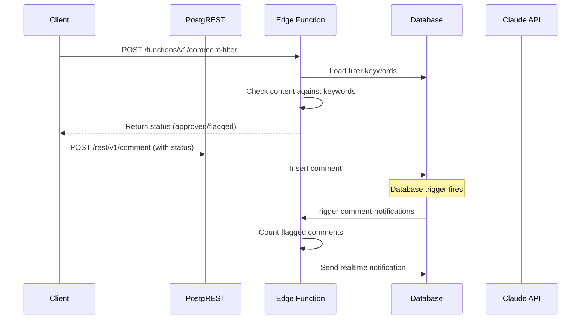

# Supabase PostgREST + Edge Functions Mapping Strategy

## Overview
This document explains how the Nowhere Land API maps to Supabase's native capabilities using PostgREST for database operations and Edge Functions for custom business logic.

## Architecture Components

### 1. Supabase Auth (`/auth/v1/*`)
**Native Supabase endpoints** - no custom implementation needed:
- `/auth/v1/signup` - User registration
- `/auth/v1/token` - Login and token refresh
- `/auth/v1/logout` - Session termination
- `/.well-known/jwks.json` - JWT public keys

### 2. PostgREST Database API (`/rest/v1/*`)
**Auto-generated REST API** from database schema with RLS policies:

#### Posts
```sql
-- Database table: post
-- PostgREST endpoint: /rest/v1/post
```

**Examples**:
```http
# Get all published posts
GET /rest/v1/post?status=eq.published&select=id,title,abstract,tags,thumbnail,view_count,created_at

# Get specific post with references
GET /rest/v1/post?id=eq.1weyuz23fx&select=*,reference(*)

# Create new post (admin only, RLS enforced)
POST /rest/v1/post
Authorization: Bearer {jwt}
Content-Type: application/json
{
  "title": "My Blog Post",
  "content": "Post content...",
  "status": "published"
}

# Update post
PATCH /rest/v1/post?id=eq.1weyuz23fx
{
  "title": "Updated Title"
}

# Soft delete (update status)
PATCH /rest/v1/post?id=eq.1weyuz23fx
{
  "status": "deleted"
}
```

#### Comments
```sql
-- Database table: comment
-- PostgREST endpoint: /rest/v1/comment
```

**Examples**:
```http
# Get approved comments for a post
GET /rest/v1/comment?post_id=eq.1weyuz23fx&status=eq.approved&order=created_at.asc

# Get flagged comments (admin only)
GET /rest/v1/comment?status=eq.flagged&select=id,post_id,post(title),nickname,content,created_at
Authorization: Bearer {admin_jwt}
```

#### Admin Tables
```http
# Filter keywords management
GET /rest/v1/filter_keyword
POST /rest/v1/filter_keyword
PATCH /rest/v1/filter_keyword?id=eq.abc123

# User profiles (admin approval)
GET /rest/v1/user_profile?approved=eq.false
PATCH /rest/v1/user_profile?id=eq.user123
```

### 3. Edge Functions (`/functions/v1/*`)
**Custom Deno functions** for business logic that can't be handled by PostgREST:

#### Comment Processing Pipeline


#### Search Handler
```http
POST /functions/v1/search-handler
{
  "q": "nextjs development",
  "tags": ["dev", "tutorial"],
  "limit": 10,
  "offset": 0
}
```

**Function Logic**:
1. Parse text query and tags
2. Try OpenSearch first
3. Fallback to PostgreSQL full-text search
4. Log search analytics (anonymized)
5. Return formatted results

#### AI Content Generation
```http
# Generate tags
POST /functions/v1/ai-tag-generator
Authorization: Bearer {admin_jwt}
{
  "title": "Building a Blog Platform",
  "content": "In this post, I'll walk through..."
}

# Generate abstract
POST /functions/v1/ai-abstract-generator
Authorization: Bearer {admin_jwt}
{
  "title": "Building a Blog Platform",
  "content": "In this post, I'll walk through..."
}
```

#### Image Processing
```http
# Process uploaded image
POST /functions/v1/image-processor
Authorization: Bearer {admin_jwt}
Content-Type: multipart/form-data

image: [binary data]
description: "Blog post hero image"

# Serve processed image
GET /functions/v1/media-cdn/abc123def456?width=720
```

## PostgREST Query Patterns

### Filtering (WHERE clauses)
```http
# Equality
GET /rest/v1/post?status=eq.published

# Multiple conditions (AND)
GET /rest/v1/post?status=eq.published&author_id=eq.admin123

# Array contains
GET /rest/v1/post?tags=cs.{dev,tutorial}

# Text search
GET /rest/v1/post?title=ilike.*nextjs*
```

### Selecting Columns
```http
# Specific columns
GET /rest/v1/post?select=id,title,created_at

# With foreign key joins
GET /rest/v1/post?select=*,comment(id,nickname,content)

# Nested selection
GET /rest/v1/comment?select=id,content,post(title,abstract)
```

### Ordering and Pagination
```http
# Order by creation date (newest first)
GET /rest/v1/post?order=created_at.desc

# Pagination
GET /rest/v1/post?limit=10&offset=20

# Multiple sorts
GET /rest/v1/post?order=view_count.desc,created_at.desc
```

### Counting and Aggregation
```http
# Count only
GET /rest/v1/post?select=count()

# Count with header
GET /rest/v1/post
Prefer: count=exact
```

## Row Level Security (RLS) Policies

### Posts Table
```sql
-- Anonymous users: only published posts
CREATE POLICY "Posts viewable by everyone" ON post
  FOR SELECT USING (status = 'published');

-- Admin users: full access
CREATE POLICY "Posts manageable by admin" ON post
  FOR ALL USING (
    auth.jwt() ->> 'role' = 'admin' AND
    (auth.jwt() ->> 'approved')::boolean = true
  );
```

### Comments Table
```sql
-- Anonymous: read approved comments
CREATE POLICY "Comments viewable by everyone" ON comment
  FOR SELECT USING (status = 'approved');

-- Anonymous: insert comments (will be filtered)
CREATE POLICY "Comments insertable by everyone" ON comment
  FOR INSERT WITH CHECK (true);

-- Admin: full access to all comments
CREATE POLICY "Comments manageable by admin" ON comment
  FOR ALL USING (
    auth.jwt() ->> 'role' = 'admin'
  );
```

### Admin Tables
```sql
-- Only admin can access filter keywords
CREATE POLICY "Filter keywords admin only" ON filter_keyword
  FOR ALL USING (
    auth.jwt() ->> 'role' = 'admin' AND
    (auth.jwt() ->> 'approved')::boolean = true
  );
```

## Database Triggers → Edge Functions

### Post Indexing Trigger
```sql
CREATE OR REPLACE FUNCTION trigger_post_indexer()
RETURNS trigger AS $$
BEGIN
  PERFORM net.http_post(
    url := 'https://prod-xxx.supabase.co/functions/v1/post-indexer',
    headers := '{"Content-Type": "application/json", "Authorization": "Bearer ' || current_setting('app.service_key') || '"}',
    body := json_build_object(
      'type', TG_OP,
      'record', row_to_json(CASE WHEN TG_OP = 'DELETE' THEN OLD ELSE NEW END)
    )::text
  );
  RETURN NULL;
END;
$$ LANGUAGE plpgsql;

CREATE TRIGGER post_indexer_trigger
  AFTER INSERT OR UPDATE OR DELETE ON post
  FOR EACH ROW EXECUTE FUNCTION trigger_post_indexer();
```

### Comment Notification Trigger
```sql
CREATE OR REPLACE FUNCTION trigger_comment_notifications()
RETURNS trigger AS $$
BEGIN
  IF NEW.status = 'flagged' OR (OLD.status = 'flagged' AND NEW.status != 'flagged') THEN
    PERFORM net.http_post(
      url := 'https://prod-xxx.supabase.co/functions/v1/comment-notifications',
      headers := '{"Content-Type": "application/json", "Authorization": "Bearer ' || current_setting('app.service_key') || '"}',
      body := json_build_object('type', TG_OP, 'record', row_to_json(NEW))::text
    );
  END IF;
  RETURN NULL;
END;
$$ LANGUAGE plpgsql;
```

## Frontend Integration

### Supabase Client Setup
```typescript
// lib/supabase.ts
import { createClientComponentClient } from '@supabase/auth-helpers-nextjs'

export const supabase = createClientComponentClient()
```

### PostgREST Queries
```typescript
// Get published posts
const { data: posts } = await supabase
  .from('post')
  .select('id, title, abstract, tags, thumbnail, view_count, created_at')
  .eq('status', 'published')
  .order('created_at', { ascending: false })
  .limit(10)

// Get post with references
const { data: post } = await supabase
  .from('post')
  .select(`
    *,
    reference (
      id,
      reference_number,
      text,
      url,
      selected_text
    )
  `)
  .eq('id', postId)
  .single()

// Create comment (will trigger filtering)
const { data: comment } = await supabase
  .from('comment')
  .insert({
    post_id: postId,
    nickname: 'User',
    password_hash: hashedPassword,
    content: 'Great post!'
  })
  .select()
  .single()
```

### Edge Function Calls
```typescript
// Search posts
const searchResponse = await supabase.functions.invoke('search-handler', {
  body: {
    q: 'nextjs tutorial',
    tags: ['dev'],
    limit: 10,
    offset: 0
  }
})

// Generate AI content (admin only)
const aiResponse = await supabase.functions.invoke('ai-tag-generator', {
  body: {
    title: postTitle,
    content: postContent
  },
  headers: {
    Authorization: `Bearer ${session?.access_token}`
  }
})

// Process image (admin only)
const formData = new FormData()
formData.append('image', file)
formData.append('description', 'Hero image')

const imageResponse = await supabase.functions.invoke('image-processor', {
  body: formData,
  headers: {
    Authorization: `Bearer ${session?.access_token}`
  }
})
```

## Benefits of This Architecture

1. **Minimal Custom Code**: PostgREST handles 80% of CRUD operations automatically
2. **Type Safety**: Database schema generates TypeScript types
3. **Real-time**: Built-in WebSocket subscriptions for live updates
4. **Security**: RLS policies enforce authorization at database level
5. **Scalability**: Supabase handles infrastructure scaling
6. **Cost Effective**: Serverless Edge Functions + managed database
7. **Developer Experience**: Single codebase, consistent patterns

## Deployment Considerations

### Environment Variables
```bash
# Supabase Configuration
NEXT_PUBLIC_SUPABASE_URL=https://prod-xxx.supabase.co
NEXT_PUBLIC_SUPABASE_ANON_KEY=eyJhbGc...
SUPABASE_SERVICE_ROLE_KEY=eyJhbGc... # For Edge Functions

# AI Services
CLAUDE_API_KEY=sk-ant-...

# Search
OPENSEARCH_ENDPOINT=https://search-xxx.region.es.amazonaws.com
OPENSEARCH_API_KEY=xxx
```

### Database Setup
1. Run migrations for table creation
2. Set up RLS policies
3. Create database triggers
4. Configure foreign key relationships

### Edge Function Deployment
```bash
# Deploy all functions
supabase functions deploy

# Deploy specific function
supabase functions deploy comment-filter
```

This architecture provides a clean separation between standard CRUD operations (PostgREST) and custom business logic (Edge Functions) while maintaining type safety and security throughout the stack.