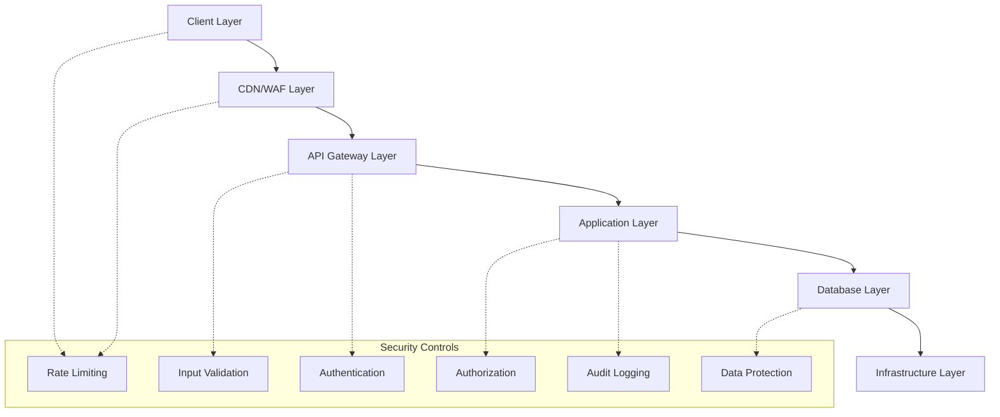
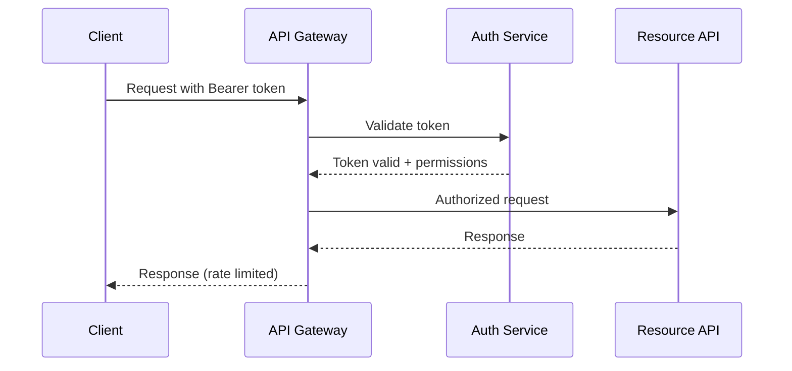
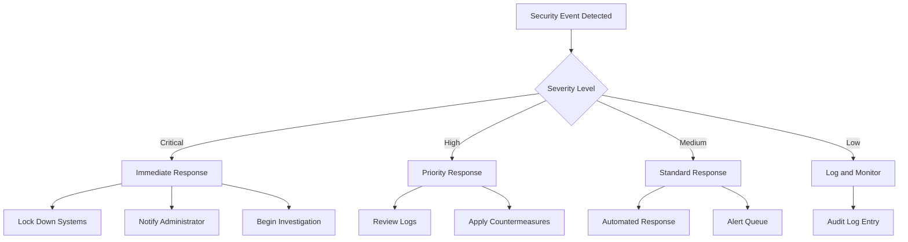

# Security Policies & Authorization Framework - PRD

## 📋 Overview

**Domain**: Security (`security`)  
**Responsibility**: Comprehensive security framework and authorization policies  
**Key Entities**: SecurityPolicy, AuthorizationRule, AuditLog, SecurityEvent  

This document defines the complete security framework for the Nowhere Land blog platform, consolidating security policies from all domains into a unified authorization system.

## 🔐 Security Architecture

### Security Layers



### Security Principles

1. **Defense in Depth**: Multiple security layers at each level
2. **Least Privilege**: Minimal necessary permissions granted
3. **Zero Trust**: Verify every request regardless of source
4. **Privacy by Design**: Data protection built into system architecture
5. **Audit Everything**: Comprehensive logging of security events

## 👥 User Roles & Permissions

### Role Definitions

#### 1. Anonymous User
- **Description**: Non-authenticated public visitors
- **Permissions**: Read published content, submit comments
- **Restrictions**: Cannot access admin functions, limited rate limits

#### 2. Admin
- **Description**: Single blog administrator (site owner)
- **Permissions**: Full system access, content management, configuration
- **Restrictions**: None (full privileges)

#### 3. System
- **Description**: Internal services and automated processes
- **Permissions**: Backend operations, data processing, analytics
- **Restrictions**: No user-facing operations

### Permission Categories

| Category | Description | Scope |
|----------|-------------|-------|
| **Read** | View/access content | Public content, own data |
| **Write** | Create/modify content | Own content, comments |
| **Delete** | Remove content | Own content (soft delete) |
| **Full** | Complete control | All CRUD operations |
| **Admin** | Administrative functions | System configuration |

## 🗃️ Comprehensive Authorization Matrix

### Content Management

| Resource | Anonymous | Admin | System |
|----------|-----------|-------|--------|
| **Published Posts** | ✅ Read | ✅ Full | ✅ Read |
| **Draft Posts** | ❌ | ✅ Full | ✅ Read |
| **Post Editor** | ❌ | ✅ Full | ❌ |
| **Post History** | ❌ | ✅ Read | ✅ Read |
| **Post Tags** | ✅ Read | ✅ Full | ✅ Read |
| **Post References** | ✅ Read | ✅ Full | ✅ Read |
| **Post Publishing** | ❌ | ✅ Admin | ❌ |

### User Management

| Resource | Anonymous | Admin | System |
|----------|-----------|-------|--------|
| **Login Page** | ✅ Read | ✅ Read | ✅ Read |
| **Admin Dashboard** | ❌ | ✅ Full | ✅ Read |
| **Admin Profile** | ❌ | ✅ Full | ✅ Full |
| **Session Management** | ❌ | ✅ Full | ✅ Full |
| **Password Change** | ❌ | ✅ Admin | ❌ |
| **Audit Logs** | ❌ | ✅ Read | ✅ Full |

### Comment System

| Resource | Anonymous | Admin | System |
|----------|-----------|-------|--------|
| **View Comments** | ✅ Read | ✅ Read | ✅ Read |
| **Submit Comment** | ✅ Write* | ✅ Write** | ❌ |
| **Edit Own Comment** | ✅ Write* | ✅ Write | ❌ |
| **Delete Own Comment** | ✅ Delete* | ✅ Delete | ❌ |
| **Moderate Comments** | ❌ | ✅ Admin | ❌ |
| **View Spam Queue** | ❌ | ✅ Read | ✅ Read |
| **Comment Settings** | ❌ | ✅ Admin | ✅ Read |

*Requires password verification  
**Admin can comment without username/password when logged in

### Media Management

| Resource | Anonymous | Admin | System |
|----------|-----------|-------|--------|
| **View Images** | ✅ Read | ✅ Read | ✅ Read |
| **Upload Images** | ❌ | ✅ Write | ❌ |
| **Media Library** | ❌ | ✅ Full | ✅ Read |
| **Delete Images** | ❌ | ✅ Delete | ✅ Delete |
| **CDN Delivery** | ✅ Read | ✅ Read | ✅ Full |
| **Image Processing** | ❌ | ❌ | ✅ Full |

### Search & Discovery

| Resource | Anonymous | Admin | System |
|----------|-----------|-------|--------|
| **Text Search** | ✅ Read | ✅ Read | ✅ Read |
| **Tag Search** | ✅ Read | ✅ Read | ✅ Read |
| **Search Suggestions** | ✅ Read | ✅ Read | ✅ Read |
| **Search Analytics** | ❌ | ✅ Read | ✅ Full |
| **Search Configuration** | ❌ | ✅ Admin | ✅ Read |

### Analytics & Monitoring

| Resource | Anonymous | Admin | System |
|----------|-----------|-------|--------|
| **Generate Analytics Events** | ✅ Tracked | ✅ Tracked | ✅ Full |
| **View Analytics Dashboard** | ❌ | ✅ Read | ❌ |
| **Export Analytics Data** | ❌ | ✅ Export | ❌ |
| **Configure Analytics** | ❌ | ✅ Admin | ✅ Read |

### Admin Settings

| Resource | Anonymous | Admin | System |
|----------|-----------|-------|--------|
| **View Settings** | ❌ | ✅ Read | ✅ Read |
| **Modify Theme** | ❌ | ✅ Admin | ❌ |
| **Manage Tags** | ❌ | ✅ Admin | ❌ |
| **Edit About Me** | ❌ | ✅ Admin | ❌ |
| **Site Configuration** | ❌ | ✅ Admin | ✅ Read |
| **Profile Management** | ❌ | ✅ Full | ❌ |
| **Settings Backup** | ❌ | ✅ Admin | ❌ |

## 🛡️ Security Policies by Domain

### Authentication Policies

#### Password Security
- **Standard**: NIST SP 800-63-4 compliant
- **Length**: 8-64 characters
- **Characters**: All Unicode characters allowed
- **Hashing**: PBKDF2 with 10,000+ iterations
- **Salt**: Unique random salt per password
- **Rotation**: No forced rotation (security anti-pattern)

#### Session Management
- **Session Duration**: 1 hour active session
- **Refresh Token**: 30 days maximum
- **Cookie Security**: HttpOnly, Secure, SameSite=Strict
- **Token Format**: Cryptographically secure random tokens
- **Concurrent Sessions**: Allowed (mobile/desktop scenarios)

#### Rate Limiting
| Operation | Limit | Window |
|-----------|--------|--------|
| Login Attempts | 5 attempts | 15 minutes |
| Password Reset | 3 attempts | 1 hour |
| Comment Submission | 5 comments | 1 hour |
| Search Queries | 30 searches | 1 minute |
| Media Upload | 10 uploads | 10 minutes |

### Input Validation Policies

#### Content Sanitization
- **HTML Sanitization**: Strip all script tags, event handlers
- **Markdown Processing**: Safe markdown parsing only
- **SQL Injection**: Parameterized queries mandatory
- **XSS Prevention**: Content Security Policy enforced
- **File Upload**: Magic number validation, virus scanning

#### Content Security Policy (CSP)
- **Purpose**: Prevent XSS attacks and code injection
- **Implementation**: HTTP headers + meta tags
- **Directives**: Whitelist trusted sources for scripts, styles, images
- **Enforcement**: Report violations, block unauthorized resources

```http
Content-Security-Policy: 
  default-src 'self';
  script-src 'self' 'unsafe-inline' vercel.live;
  style-src 'self' 'unsafe-inline';
  img-src 'self' data: blob: *.supabase.co;
  connect-src 'self' *.supabase.co *.anthropic.com;
  frame-src 'none';
  object-src 'none';
  base-uri 'self';
  form-action 'self';
```

**CSP Security Benefits**:
- Blocks malicious scripts in user comments
- Prevents unauthorized iframe embedding
- Stops data exfiltration via unauthorized connections
- Protects against AI-generated content script injection
- Provides violation reporting for security monitoring

#### Data Validation Rules
```typescript
// Example validation schema
const ValidationRules = {
  postTitle: {
    minLength: 1,
    maxLength: 200,
    pattern: /^[^<>{}]*$/  // No angle brackets or braces
  },
  commentContent: {
    minLength: 1,
    maxLength: 2000,
    sanitize: true
  },
  searchQuery: {
    minLength: 2,
    maxLength: 100,
    sanitize: true
  },
  tagName: {
    pattern: /^[a-z0-9-]+$/,  // Lowercase alphanumeric + hyphens
    maxLength: 50
  }
}
```

### Data Protection Policies

#### Privacy Compliance
- **GDPR Compliance**: Data minimization, right to erasure
- **CCPA Compliance**: Opt-out mechanisms, data transparency
- **Data Collection**: Only necessary data collected
- **Data Retention**: Automatic purging per retention schedules
- **Anonymization**: All analytics data anonymized

#### Encryption Standards
- **Data in Transit**: TLS 1.3 minimum
- **Data at Rest**: AES-256 encryption for sensitive data
- **Database**: Row-level security (RLS) policies
- **Backups**: Encrypted backup storage
- **Key Management**: Secure key rotation procedures

### API Security Policies

#### API Gateway Protection
- **Rate Limiting**: Per-endpoint limits enforced
- **CORS**: Strict origin validation
- **Request Size**: Maximum payload limits
- **Timeout**: Request timeout enforcement
- **Error Handling**: No sensitive data in error responses

#### API Authentication


## 📊 Audit & Monitoring

### Security Events Logging

#### High-Priority Events (Immediate Alert)
- Failed login attempts (5+ in 15 minutes)
- Privilege escalation attempts
- Unusual data access patterns
- Failed authorization checks
- System configuration changes

#### Standard Events (Daily Review)
- Successful logins
- Content modifications
- Comment submissions
- Search queries (anonymized)
- File uploads

#### Audit Log Format
```json
{
  "timestamp": "2025-01-13T10:30:00Z",
  "event_type": "AUTHENTICATION_FAILURE",
  "user_id": "admin",
  "ip_address": "192.168.1.***",  // Last octet masked
  "user_agent": "Mozilla/5.0...",
  "resource": "/admin/login",
  "details": {
    "reason": "invalid_password",
    "attempt_count": 3
  },
  "risk_level": "medium"
}
```

### Security Monitoring

#### Real-time Monitoring
- **Intrusion Detection**: Unusual access patterns
- **Rate Limit Violations**: Automated blocking
- **Error Rate Monitoring**: Application health
- **Resource Usage**: DDoS detection
- **Security Headers**: Proper header enforcement

#### Compliance Monitoring
- **Data Access Tracking**: Who accessed what data
- **Retention Compliance**: Automatic data purging
- **Privacy Compliance**: Opt-out enforcement
- **Security Policy Adherence**: Configuration validation

## 🚨 Incident Response

### Security Incident Classification

#### Severity Levels
1. **Critical**: Data breach, system compromise
2. **High**: Authentication bypass, privilege escalation
3. **Medium**: Rate limit violations, suspicious activity
4. **Low**: Failed login attempts, minor policy violations

#### Response Procedures



### Recovery Procedures
1. **Immediate**: Isolate affected systems
2. **Assessment**: Determine scope and impact
3. **Containment**: Prevent further damage
4. **Eradication**: Remove threat from system
5. **Recovery**: Restore normal operations
6. **Lessons Learned**: Update security measures

## 🔧 Security Configuration

### Environment-Specific Settings

#### Production Security
```yaml
security:
  https_only: true
  strict_transport_security: true
  content_security_policy: "default-src 'self'"
  rate_limiting: strict
  session_timeout: 3600  # 1 hour
  password_requirements: maximum
  audit_logging: comprehensive
```

#### Development Security
```yaml
security:
  https_only: false  # For localhost development
  rate_limiting: relaxed
  session_timeout: 86400  # 24 hours
  password_requirements: standard
  audit_logging: essential
```

### Security Headers
```http
Strict-Transport-Security: max-age=31536000; includeSubDomains
Content-Security-Policy: default-src 'self'; img-src 'self' data: https:
X-Frame-Options: DENY
X-Content-Type-Options: nosniff
Referrer-Policy: strict-origin-when-cross-origin
Permissions-Policy: geolocation=(), microphone=(), camera=()
```

## ✅ Security Compliance Checklist

### Authentication & Authorization
- [ ] NIST SP 800-63-4 password requirements implemented
- [ ] Multi-factor authentication ready (future enhancement)
- [ ] Session management secure (HttpOnly, Secure cookies)
- [ ] Rate limiting enforced on all authentication endpoints
- [ ] Authorization matrix fully implemented

### Data Protection
- [ ] GDPR compliance measures in place
- [ ] CCPA opt-out mechanisms implemented
- [ ] Data encryption at rest and in transit
- [ ] Data retention policies automated
- [ ] Privacy policy covers all data collection

### Application Security
- [ ] Input validation on all user inputs
- [ ] Output encoding prevents XSS
- [ ] SQL injection protection via parameterized queries
- [ ] File upload security (type validation, virus scanning)
- [ ] Error handling doesn't leak sensitive information

### Infrastructure Security
- [ ] TLS 1.3 enforced for all connections
- [ ] Security headers properly configured
- [ ] Database access controls implemented
- [ ] Regular security updates applied
- [ ] Backup encryption and secure storage

### Monitoring & Audit
- [ ] Comprehensive audit logging implemented
- [ ] Security event monitoring configured
- [ ] Incident response procedures documented
- [ ] Regular security assessment scheduled
- [ ] Compliance monitoring automated

This comprehensive security framework ensures the Nowhere Land blog platform maintains robust security while supporting the intended functionality for both anonymous users and the single administrator.