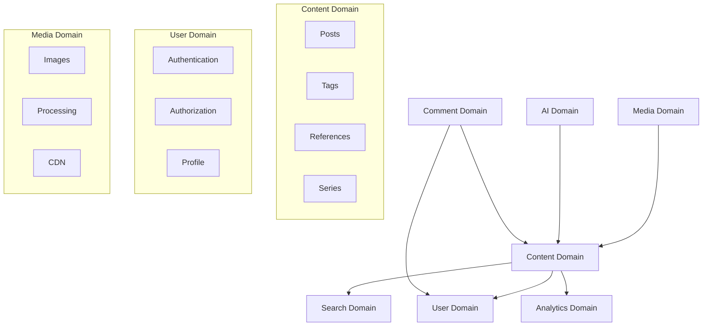

# Nowhere Land - Product Requirements Document (PRD)

## 📋 Executive Summary

**Product Name**: Nowhere Land  
**Version**: 1.0  
**Document Version**: 1.0  
**Last Updated**: 2025-01-13  
**Owner**: Jan Kim  

### Vision Statement
Nowhere Land is a personal blog platform that serves as an incarnation of the author's personality on the internet. It combines personal thoughts, technical insights, and life experiences in a simple yet powerful blogging platform that reflects the author's philosophy of clean, meaningful digital experiences.

### Product Goals
1. **Personal Expression**: Create a digital space that authentically represents the author's thoughts and personality
2. **Content Discovery**: Enable readers to easily find and engage with content through intelligent search and categorization
3. **Technical Excellence**: Demonstrate best practices in modern web development while maintaining simplicity
4. **Community Engagement**: Foster meaningful discussions through comments and interactions
5. **Scalability**: Design for future growth while avoiding over-engineering

## 🏗️ Domain Model

### Core Domains



### Domain Definitions

#### 1. **Content Domain** (`content`)
- **Responsibility**: Managing blog posts, tags, references, and content organization
- **Key Entities**: Post, Tag, Reference, Series
- **Business Rules**: Content lifecycle, publishing rules, tagging policies

#### 2. **User Domain** (`user`)
- **Responsibility**: User management, authentication, and authorization
- **Key Entities**: User, Role, Session
- **Business Rules**: Admin-only access, secure authentication

#### 3. **Media Domain** (`media`)
- **Responsibility**: Image and file management, processing, and delivery
- **Key Entities**: Image, Thumbnail, ProcessedAsset
- **Business Rules**: File type validation, size limits, CDN optimization

#### 4. **AI Domain** (`ai`)
- **Responsibility**: AI-powered content enhancement (tags, abstracts, analysis)
- **Key Entities**: TagSuggestion, AbstractGeneration, ContentAnalysis
- **Business Rules**: Quality thresholds, cost optimization, fallback strategies

#### 5. **Search Domain** (`search`)
- **Responsibility**: Content discovery and search functionality
- **Key Entities**: SearchIndex, Query, Result, Facet
- **Business Rules**: Indexing policies, search relevance, faceted navigation

#### 6. **Comment Domain** (`comment`)
- **Responsibility**: User-generated comments and moderation
- **Key Entities**: Comment, CommentThread, Moderation
- **Business Rules**: Anonymous commenting, password protection, moderation workflow

#### 7. **Analytics Domain** (`analytics`)
- **Responsibility**: Usage tracking, performance metrics, and insights
- **Key Entities**: PageView, Session, Metric, Report
- **Business Rules**: Privacy compliance, data retention, aggregation

## 🎯 Use Case Categories

### 1. **Core Content Management** (UC-CM-xxx)
- Post creation, editing, publishing
- Tag management and assignment
- Reference system
- Content organization

### 2. **User Experience** (UC-UX-xxx)
- Authentication and session management
- Content consumption and navigation
- Search and discovery
- Responsive interactions

### 3. **AI-Enhanced Features** (UC-AI-xxx)
- Automatic tag generation
- Abstract creation
- Content analysis and optimization
- Quality scoring

### 4. **Media Operations** (UC-MO-xxx)
- Image upload and processing
- Thumbnail generation
- CDN delivery
- Asset optimization

### 5. **Community Interaction** (UC-CI-xxx)
- Comment submission and management
- Moderation workflows
- Community guidelines enforcement

### 6. **Analytics & Insights** (UC-AN-xxx)
- Usage tracking
- Performance monitoring
- Content analytics
- Dashboard reporting

### 7. **Administrative Functions** (UC-AD-xxx)
- System configuration
- User management
- Content moderation
- Maintenance operations

## 🔐 Security Framework

### Authorization Levels
1. **Anonymous** - Public content access
2. **Authenticated User** - Comment functionality
3. **Admin** - Full system access
4. **System** - Internal service operations

### Security Policies
- **Policy-Based Authorization**: Each use case defines specific authorization requirements
- **Row-Level Security (RLS)**: Database-level access control
- **API Security**: Rate limiting, CORS, input validation
- **Data Protection**: GDPR/CCPA compliance, privacy controls

## 📊 Success Metrics

### Key Performance Indicators (KPIs)
1. **Content Quality**: Average reading time, engagement rate
2. **User Experience**: Page load times, bounce rate, search success rate
3. **Technical Performance**: Uptime, response times, error rates
4. **Cost Efficiency**: Infrastructure costs per user, AI processing costs
5. **Growth**: Monthly active users, content creation rate

### Measurement Strategy
- Real-time performance monitoring
- User behavior analytics
- Content performance tracking
- Infrastructure cost optimization
- AI system effectiveness

## 🔄 Development Approach

### Domain-Driven Design (DDD)
- **Bounded Contexts**: Clear domain boundaries
- **Ubiquitous Language**: Consistent terminology across domains
- **Aggregate Roots**: Well-defined entity relationships
- **Domain Services**: Business logic encapsulation

### Test-Driven Development (TDD)
- **Unit Tests**: Individual component testing
- **Integration Tests**: Cross-domain interaction testing
- **End-to-End Tests**: Complete user journey validation
- **Performance Tests**: Load and stress testing

### Behavior-Driven Development (BDD)
- **Given-When-Then**: Clear scenario definitions
- **Living Documentation**: Executable specifications
- **Stakeholder Collaboration**: Non-technical requirement validation

## 📋 Implementation Phases

### Phase 1: MVP (Minimum Viable Product)
- Basic post CRUD operations
- Simple authentication
- Basic UI components
- Essential infrastructure

### Phase 2: Enhanced Features
- AI-powered content processing
- Advanced search functionality
- Comment system
- Media processing

### Phase 3: Analytics & Optimization
- Comprehensive analytics
- Performance optimization
- Advanced admin features
- Community features

### Phase 4: Scale & Polish
- Multi-user support preparation
- Advanced AI features
- Enhanced security
- Performance at scale

## 📝 Documentation Structure

```
prd/
├── 00-overview.md              # This document
├── 01-user-management.md       # UC-UM-xxx use cases
├── 02-content-management.md    # UC-CM-xxx use cases
├── 03-ai-services.md          # UC-AI-xxx use cases
├── 04-search-discovery.md     # UC-SD-xxx use cases
├── 05-comment-system.md       # UC-CS-xxx use cases
├── 06-media-management.md     # UC-MM-xxx use cases
├── 07-analytics.md            # UC-AN-xxx use cases
├── 08-admin-settings.md       # UC-AS-xxx use cases
├── 09-security-policies.md    # Security framework
└── 10-api-specifications.md   # Technical API details
```

## 🎯 Next Steps

1. **Review Domain Model**: Validate domain boundaries and responsibilities
2. **Define Use Cases**: Create detailed use case specifications with Mermaid diagrams
3. **Security Design**: Implement comprehensive authorization policies
4. **API Design**: Define RESTful APIs based on use cases
5. **Database Schema**: Create normalized PostgreSQL schema following PRD requirements

---

This PRD serves as the foundation for all development activities and ensures that every feature aligns with the overall vision of creating a meaningful, personal blog platform that reflects the author's philosophy while providing excellent user experience.