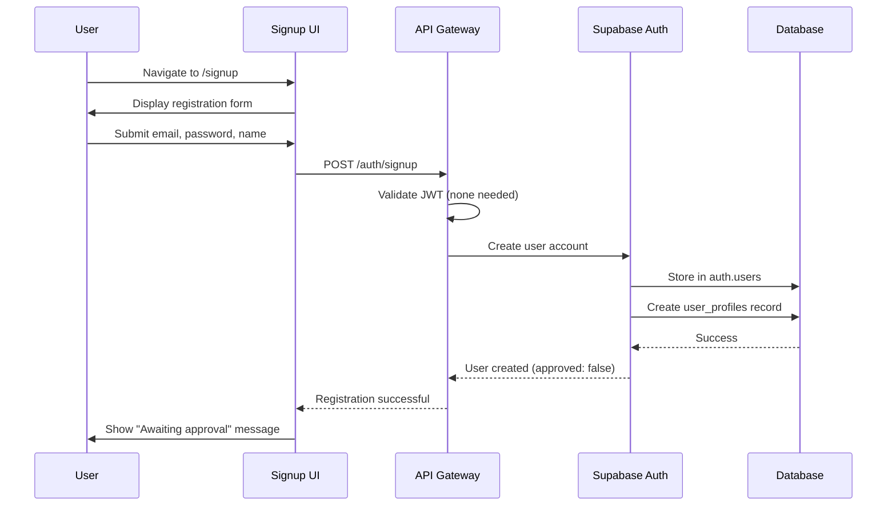
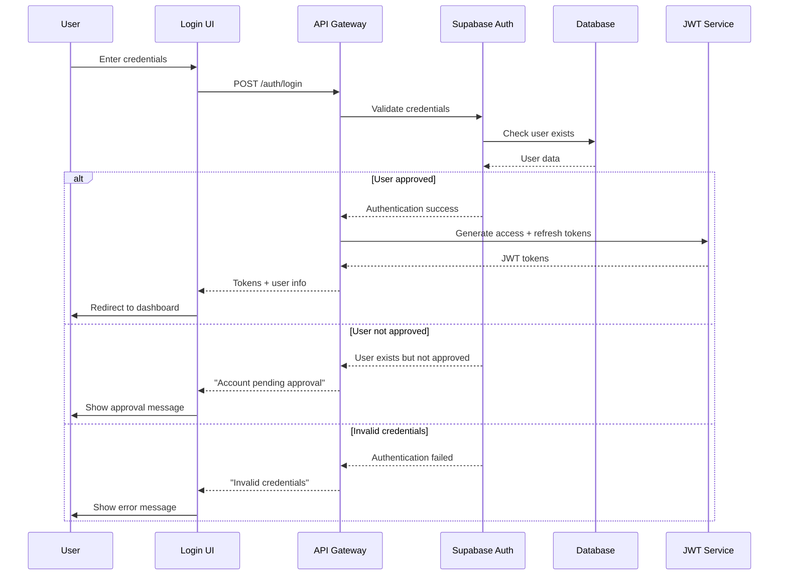
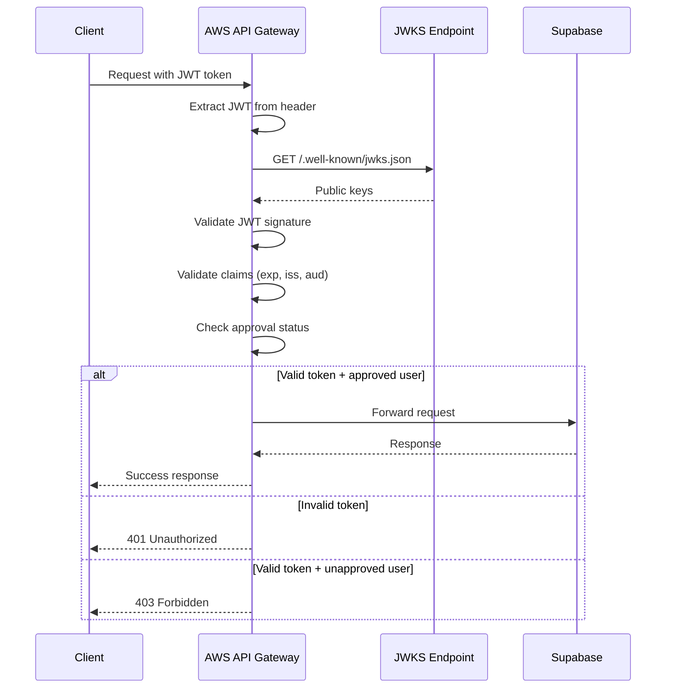
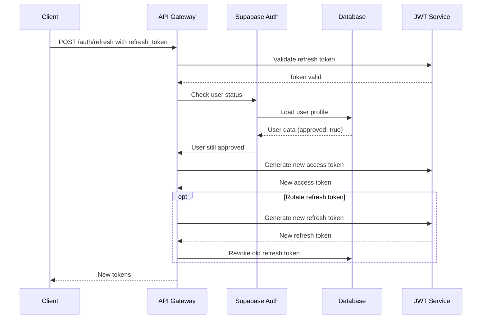
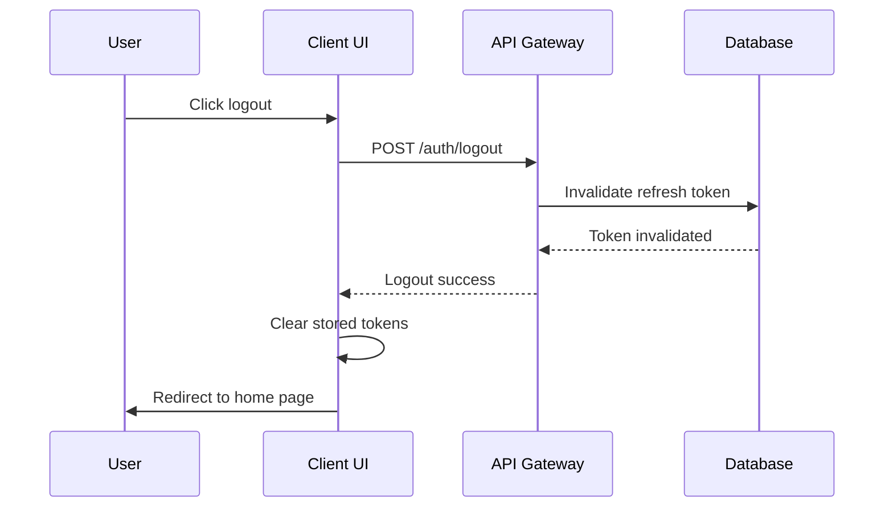
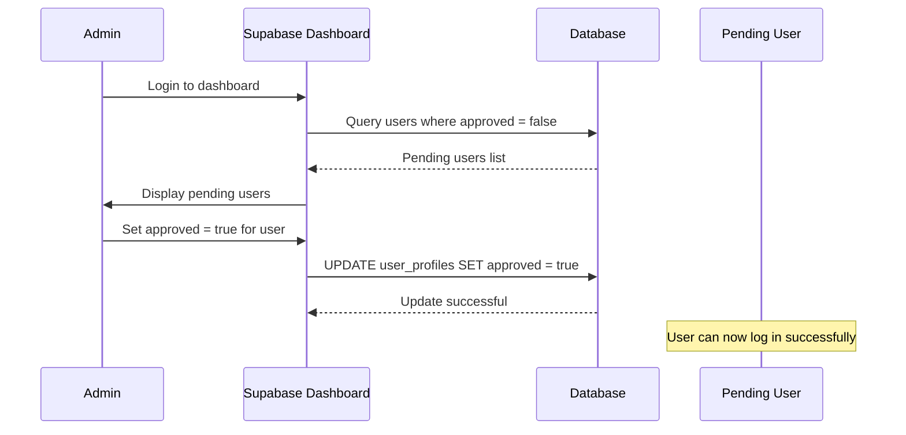

# User Management & Authentication - PRD

## 📋 Domain Overview

**Domain**: User Management (`user`)  
**Responsibility**: User registration, JWT/JWKS authentication, and admin approval workflow  
**Key Entities**: User, Session, RefreshToken, JWKS  

**Important Note**: This system supports user registration via `/signup`, but only manually approved users (admin) can actually use the blog. All users start with `approved: false` and require manual approval via Supabase dashboard.

## 🎯 Use Cases

### UC-UM-001: User Registration
**ID**: UC-UM-001  
**Name**: User Sign Up  
**Actor**: Anonymous User  
**Trigger**: User accesses `/signup` page  
**Goal**: Register new user account (pending approval)  

**Preconditions**:
- User is on signup page
- User has valid email address
- Email is not already registered

**Main Flow**:
1. User navigates to `/signup`
2. System displays registration form
3. User enters email, password, and display name
4. System validates input (email format, password strength)
5. System checks email uniqueness in Supabase
6. System creates user account with `approved: false`
7. System stores user in `auth.users` and `user_profiles` tables
8. System displays "Registration successful, awaiting approval" message
9. System sends notification to admin (optional)
10. User is redirected to login page with info message

**Alternative Flows**:
- **4a**: Invalid email format → Display validation error
- **4b**: Weak password → Display password requirements
- **5a**: Email already exists → Display "Email already registered" error
- **6a**: Registration fails → Display error, allow retry

**Business Rules**:
- All new users start with `approved: false`
- Only admin can set `approved: true` (via Supabase dashboard)
- Password must meet NIST SP 800-63-4 requirements (8-64 characters)
- Display name is required and must be 2-50 characters
- Email must be unique across all users

**Security Requirements**:
- Password hashed with PBKDF2 (handled by Supabase Auth)
- Email validation to prevent invalid addresses
- Rate limiting on signup endpoint
- No sensitive data in error messages

**Authorization**: Anonymous

---

### UC-UM-002: User Login
**ID**: UC-UM-002  
**Name**: User Login with JWT  
**Actor**: Registered User  
**Trigger**: User accesses login page  
**Goal**: Authenticate user and issue JWT tokens  

**Preconditions**:
- User has registered account
- User account is approved (`approved: true`)
- User is on login page

**Main Flow**:
1. User navigates to `/login`
2. System displays login form
3. User enters email and password
4. System validates credentials via Supabase Auth
5. System checks if user is approved
6. System generates JWT access token and refresh token
7. System includes user role and permissions in JWT claims
8. System returns tokens to client
9. System redirects to intended page or dashboard
10. System logs successful login event

**Alternative Flows**:
- **4a**: Invalid credentials → Display error message
- **5a**: User not approved → Display "Account pending approval" message
- **6a**: Token generation fails → Display system error

**Business Rules**:
- Only approved users can successfully log in
- Access tokens expire in 1 hour
- Refresh tokens expire in 30 days
- JWT includes role (admin/user) and approval status
- Failed login attempts are rate limited

**Security Requirements**:
- JWT tokens signed with RS256 algorithm
- Tokens include standard claims (iss, aud, exp, sub)
- Rate limiting: 5 failed attempts per 15 minutes per IP
- Secure token storage in httpOnly cookies (optional)

**Authorization**: Anonymous → Authenticated User

---

### UC-UM-003: JWT Token Validation
**ID**: UC-UM-003  
**Name**: JWT Token Validation via API Gateway  
**Actor**: System (AWS API Gateway)  
**Trigger**: Any authenticated API request  
**Goal**: Validate JWT token and authorize request  

**Preconditions**:
- Request includes Authorization header with JWT
- JWKS endpoint is accessible
- JWT is properly formatted

**Main Flow**:
1. Client sends request with Authorization: Bearer {jwt}
2. AWS API Gateway intercepts request
3. API Gateway extracts JWT from Authorization header
4. API Gateway fetches JWKS from Supabase endpoint
5. API Gateway validates JWT signature using JWKS
6. API Gateway validates JWT claims (exp, iss, aud)
7. API Gateway checks user approval status in JWT claims
8. If valid, request proceeds to backend service
9. If invalid, API Gateway returns 401 Unauthorized

**Alternative Flows**:
- **3a**: No Authorization header → Return 401 Unauthorized
- **4a**: JWKS endpoint unavailable → Return 503 Service Unavailable
- **5a**: Invalid signature → Return 401 Unauthorized
- **6a**: Token expired → Return 401 Unauthorized
- **7a**: User not approved → Return 403 Forbidden

**Business Rules**:
- JWT must be valid and not expired
- User must be approved to access protected resources
- JWKS keys cached by API Gateway for performance
- Token validation occurs before reaching Supabase

**Security Requirements**:
- RS256 signature validation
- Proper claim validation (exp, iss, aud)
- Rate limiting on authentication failures
- No sensitive data exposure in error responses

**Authorization**: System validation

---

### UC-UM-004: Token Refresh
**ID**: UC-UM-004  
**Name**: Refresh Access Token  
**Actor**: Authenticated User  
**Trigger**: Access token expires or near expiration  
**Goal**: Issue new access token using refresh token  

**Preconditions**:
- User has valid refresh token
- Refresh token is not expired
- User account still exists and is approved

**Main Flow**:
1. Client detects access token is expired/expiring
2. Client sends refresh token to `/auth/refresh` endpoint
3. System validates refresh token signature and claims
4. System checks if refresh token is not revoked
5. System verifies user still exists and is approved
6. System generates new access token
7. System optionally rotates refresh token
8. System returns new access token to client
9. Client stores new token and retries original request

**Alternative Flows**:
- **3a**: Invalid refresh token → Return 401, require re-login
- **4a**: Refresh token revoked → Return 401, require re-login
- **5a**: User no longer approved → Return 403, clear tokens

**Business Rules**:
- Refresh tokens can only be used once (optional rotation)
- New access token has same claims as original
- User approval status re-checked on refresh
- Refresh token rotation improves security

**Security Requirements**:
- Refresh token validation with JWKS
- Check token revocation status
- Rate limiting on refresh attempts
- Secure refresh token storage

**Authorization**: Authenticated User (with refresh token)

---

### UC-UM-005: User Logout
**ID**: UC-UM-005  
**Name**: User Logout  
**Actor**: Authenticated User  
**Trigger**: User clicks logout button  
**Goal**: Invalidate user session and tokens  

**Preconditions**:
- User is authenticated
- User has valid session/tokens

**Main Flow**:
1. User clicks logout button
2. Client sends logout request to `/auth/logout`
3. System invalidates refresh token (if token rotation used)
4. System logs logout event
5. Client clears all stored tokens
6. Client redirects to home page or login page
7. System returns success response

**Alternative Flows**:
- **3a**: Token already invalid → Continue with logout process

**Business Rules**:
- Logout should work even with invalid tokens
- All client-side tokens must be cleared
- Logout events logged for security audit
- Graceful handling of network errors

**Security Requirements**:
- Server-side token invalidation
- Client-side token clearing
- Audit logging of logout events
- No sensitive data in logout response

**Authorization**: Authenticated User

---

### UC-UM-006: Admin User Approval
**ID**: UC-UM-006  
**Name**: Manual User Approval  
**Actor**: Blog Administrator  
**Trigger**: Admin reviews pending user registrations  
**Goal**: Approve or reject user registration requests  

**Preconditions**:
- Admin has access to Supabase dashboard
- Pending users exist with `approved: false`

**Main Flow**:
1. Admin logs into Supabase dashboard
2. Admin navigates to user_profiles table
3. Admin reviews users with `approved: false`
4. Admin evaluates user information (email, display name)
5. Admin sets `approved: true` for accepted users
6. Admin optionally sets user role (admin/user)
7. System updates user record in database
8. User can now successfully log in on next attempt

**Alternative Flows**:
- **5a**: Admin rejects user → Delete user record or keep with `approved: false`
- **6a**: Admin promotes to admin role → Set appropriate permissions

**Business Rules**:
- Only admin can approve users
- Approval is binary (true/false)
- Approved users can immediately log in
- User approval history should be tracked

**Security Requirements**:
- Admin authentication required for Supabase dashboard
- Approval actions logged for audit
- Role changes require admin privileges

**Authorization**: Admin (via Supabase dashboard)

---

## 🔐 Security Policies

### Authentication Policy
- **JWT Algorithm**: RS256 (asymmetric)
- **Access Token Duration**: 1 hour
- **Refresh Token Duration**: 30 days
- **Password Requirements**: NIST SP 800-63-4 (8-64 characters)
- **Rate Limiting**: 5 failed attempts per IP per 15 minutes

### Authorization Matrix

| Resource | Anonymous | Pending User | Approved User | Admin |
|----------|-----------|--------------|---------------|-------|
| **Sign Up** | ✅ Write | ❌ | ❌ | ❌ |
| **Login** | ✅ Use | ✅ Use | ✅ Use | ✅ Use |
| **Public Content** | ✅ Read | ✅ Read | ✅ Read | ✅ Read |
| **Protected Content** | ❌ | ❌ | ✅ Read | ✅ Full |
| **Comments** | ✅ Write | ❌ | ✅ Write | ✅ Full |
| **Admin Functions** | ❌ | ❌ | ❌ | ✅ Full |
| **User Approval** | ❌ | ❌ | ❌ | ✅ Admin |

### Data Protection
- **Password Storage**: Supabase Auth (PBKDF2)
- **JWT Signing**: RS256 with key rotation
- **User Data**: Minimal collection (email, name, approval status)
- **Audit Logging**: All authentication events tracked

## 📊 Acceptance Criteria

### UC-UM-001 (User Registration)
- [ ] `/signup` endpoint accepts email, password, display name
- [ ] New users created with `approved: false`
- [ ] Email uniqueness enforced
- [ ] Password validation meets security requirements
- [ ] Success message indicates approval needed
- [ ] Rate limiting prevents spam registrations

### UC-UM-002 (User Login)
- [ ] Only approved users can log in successfully
- [ ] JWT tokens generated with correct claims
- [ ] Login failure shows appropriate error messages
- [ ] Rate limiting prevents brute force attacks
- [ ] Successful login redirects appropriately

### UC-UM-003 (JWT Validation)
- [ ] AWS API Gateway validates JWT signatures
- [ ] JWKS endpoint provides current public keys
- [ ] Expired tokens rejected with 401
- [ ] Unapproved users rejected with 403
- [ ] Valid tokens allow request to proceed

### UC-UM-004 (Token Refresh)
- [ ] Valid refresh tokens generate new access tokens
- [ ] Refresh maintains user approval status check
- [ ] Invalid refresh tokens require re-login
- [ ] Optional refresh token rotation works
- [ ] Rate limiting prevents refresh token abuse

### UC-UM-005 (User Logout)
- [ ] Logout clears client-side tokens
- [ ] Server-side token invalidation (if applicable)
- [ ] Logout works even with invalid tokens
- [ ] Successful logout redirects to home page
- [ ] Logout events logged for audit

### UC-UM-006 (Admin Approval)
- [ ] Admin can view pending users in Supabase dashboard
- [ ] Approval status update works immediately
- [ ] Approved users can log in on next attempt
- [ ] Admin can set user roles during approval
- [ ] Approval actions are audited

## 🧪 Test Scenarios

### Security Testing
1. **JWT Validation**: Test token tampering, expiration, invalid signatures
2. **Rate Limiting**: Verify login and signup rate limits work
3. **User Approval**: Ensure unapproved users cannot access protected resources
4. **Password Security**: Test password requirements enforcement

### Functional Testing
1. **Registration Flow**: Complete signup process with email verification
2. **Login Flow**: Test approved vs unapproved user login
3. **Token Lifecycle**: Access token usage, refresh, and expiration
4. **Admin Approval**: Test approval workflow via Supabase dashboard

### Integration Testing
1. **API Gateway JWT**: Test JWT validation at API Gateway level
2. **Supabase Integration**: Test user creation and authentication
3. **JWKS Endpoint**: Test public key distribution and validation
4. **Cross-Service Auth**: Test authentication across different services

This authentication system provides secure user management with admin approval workflow while leveraging AWS API Gateway for JWT validation and Supabase for user storage and authentication.