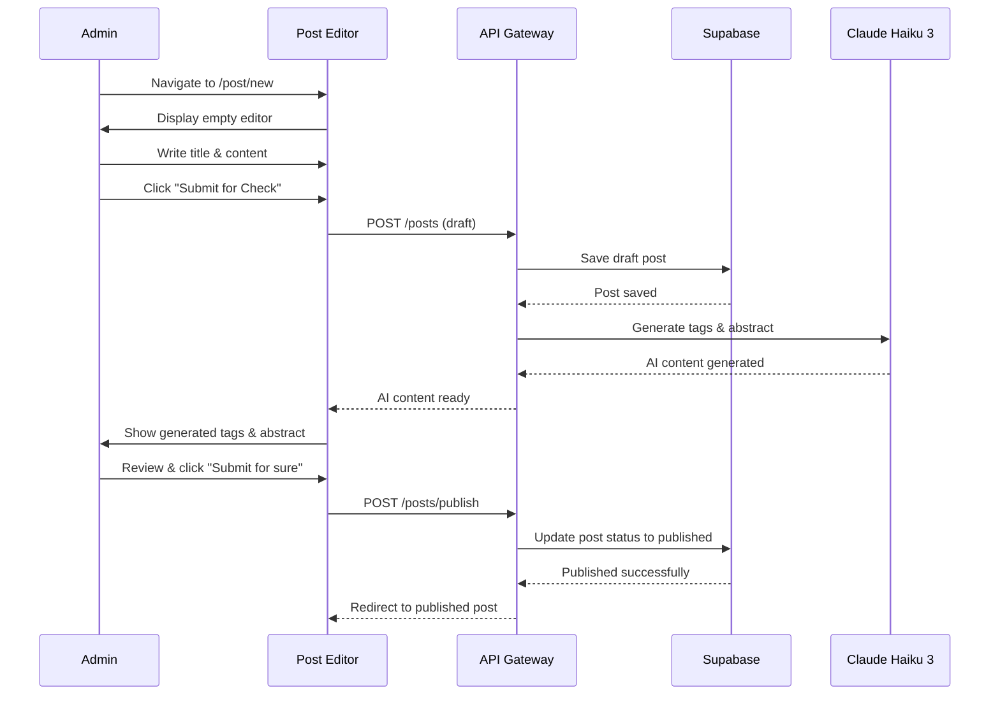
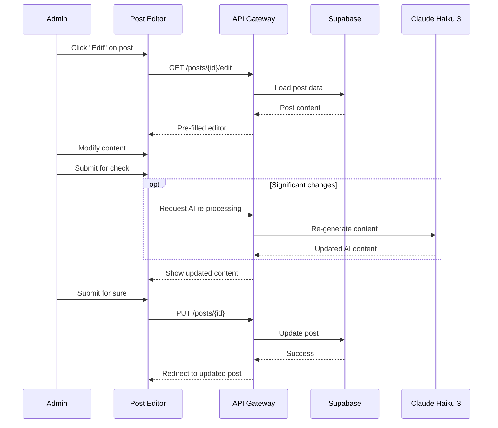
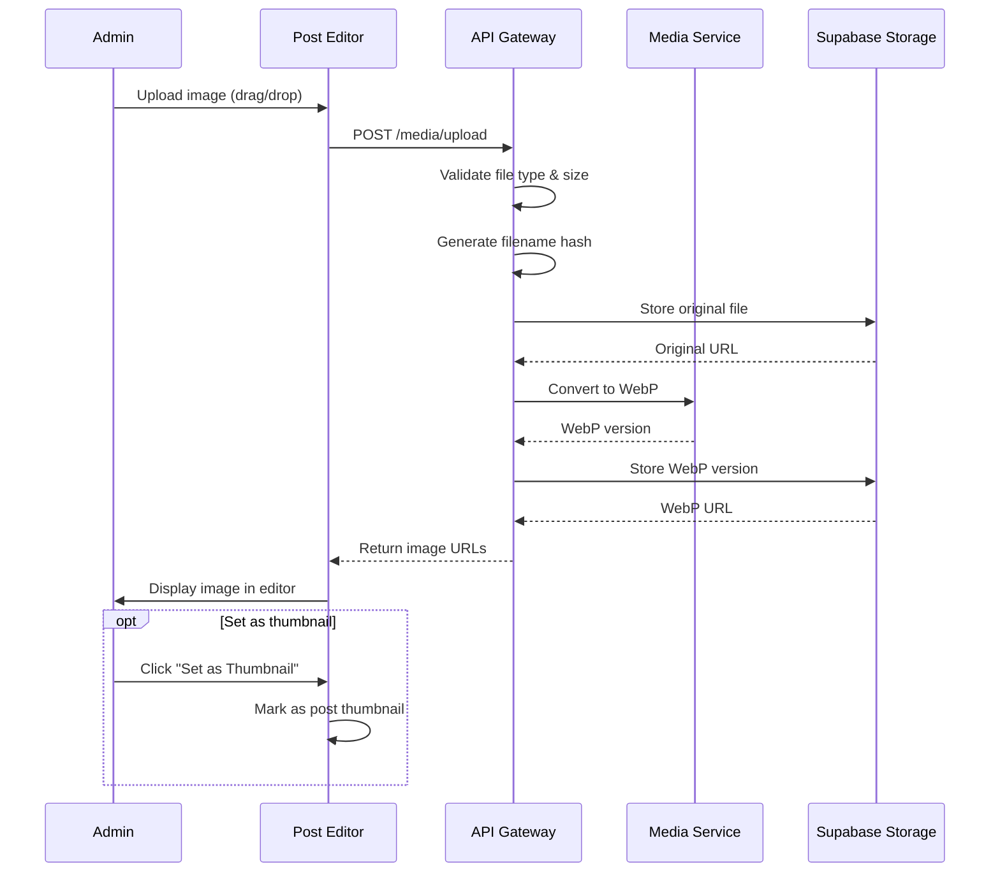
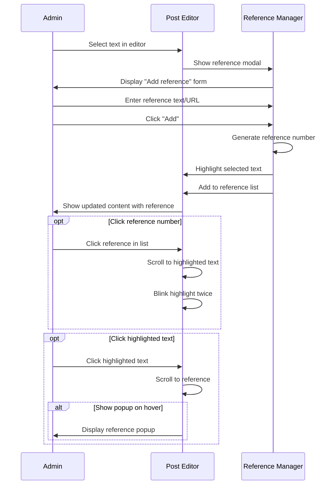
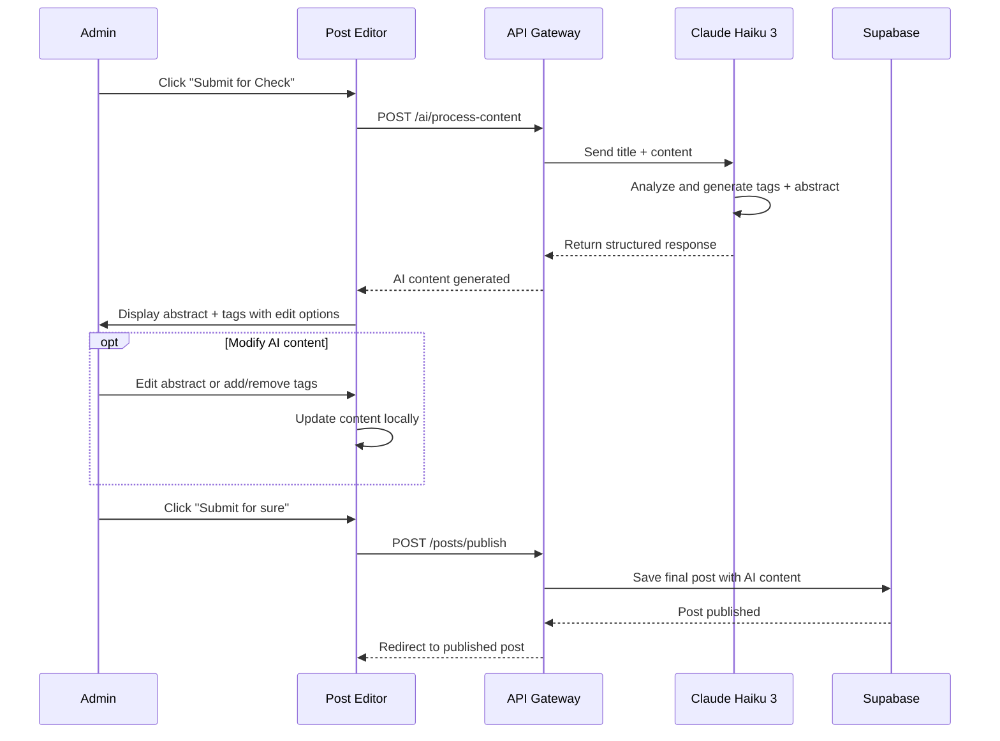
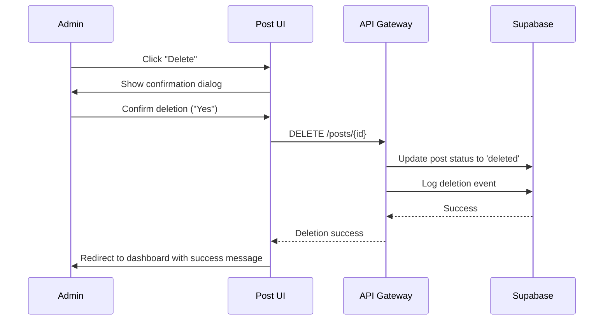

# Content Management - PRD

## 📋 Domain Overview

**Domain**: Content Management (`content`)  
**Responsibility**: Blog post creation, editing, publishing, and organization  
**Key Entities**: Post, Tag, Reference, PostMedia  

**Important Note**: Post creation is seamless - no separate `/post/check/{id}` page. The `/post/new` page handles writing, AI processing, and publishing in one flow.

## 🎯 Use Cases

### UC-CM-001: Create New Post
**ID**: UC-CM-001  
**Name**: Create New Blog Post  
**Actor**: Blog Administrator  
**Trigger**: Admin clicks "Write Post" button  
**Goal**: Create and publish a new blog post seamlessly  

**Preconditions**:
- Admin is authenticated and approved
- Admin has access to post creation interface
- Admin is on `/post/new` page

**Main Flow**:
1. Admin clicks "Write Post" button from admin dashboard
2. System navigates to `/post/new` page
3. System displays post editor with empty form (Notion/Obsidian style)
4. Admin enters post title in title field
5. Admin writes content in markdown editor
6. Admin optionally uploads images via drag-and-drop
7. Admin optionally adds references by selecting text
8. Admin optionally sets post as draft using draft checkbox
9. Admin clicks "Submit for Check" button
10. System triggers AI processing for tags and abstract generation
11. System shows "Submit for Check" → "Re-submit for Check" and adds AI components
12. System displays generated abstract and tags with loading states
13. Admin reviews and optionally modifies AI-generated content
14. Admin clicks "Submit for sure" button to publish
15. System publishes post and redirects to published post view

**Alternative Flows**:
- **4a**: Admin leaves page → Show "Are you sure to leave? Data won't be saved" warning
- **8a**: Draft checkbox checked → Post saved as draft, can be published later
- **10a**: AI processing fails → Show error, allow manual input
- **12a**: Admin stops AI processing → Use existing content or allow manual input

**Business Rules**:
- Title and content are required fields
- Posts get unique nanoid (10 characters)
- Draft posts only visible to admin
- Image uploads limited to JPG, PNG, GIF, WebP (5MB max)
- References support bidirectional navigation
- Post creation follows PRG pattern (Post-Redirect-Get)

**Security Requirements**:
- Only authenticated admin can create posts
- Content sanitized for XSS prevention
- Image uploads virus-scanned and validated
- File upload paths secured

**Authorization**: Admin

---

### UC-CM-002: Edit Existing Post
**ID**: UC-CM-002  
**Name**: Edit Existing Blog Post  
**Actor**: Blog Administrator  
**Trigger**: Admin clicks "Edit" button on published post  
**Goal**: Modify existing post content and republish  

**Preconditions**:
- Admin is authenticated and approved
- Post exists in the system
- Admin has edit permissions for the post

**Main Flow**:
1. Admin clicks "Edit" button on post detail page
2. System navigates to `/post/edit/{id}` (similar to `/post/new`)
3. System loads existing post data from database
4. System displays post editor pre-filled with current content
5. Admin modifies title, content, images, or references
6. Admin follows same AI processing flow as new post creation
7. Admin clicks "Submit for sure" to update post
8. System updates existing post record
9. System redirects to updated post view

**Alternative Flows**:
- **3a**: Post not found → Display 404 error
- **5a**: No changes made → Allow publish without AI re-processing
- **6a**: Minor changes → Skip AI re-processing option

**Business Rules**:
- Published posts can be edited without changing publication status
- Edit preserves original post ID and creation date
- Significant content changes may trigger AI re-processing
- Images and references can be added/removed during edit

**Security Requirements**:
- Only admin can edit posts
- Edit operations logged for audit
- Same content validation as post creation

**Authorization**: Admin

---

### UC-CM-003: Manage Post Images
**ID**: UC-CM-003  
**Name**: Upload and Manage Post Images  
**Actor**: Blog Administrator  
**Trigger**: Admin uploads image in post editor  
**Goal**: Process and embed images in blog post  

**Preconditions**:
- Admin is on post creation/edit page
- Image file meets format and size requirements

**Main Flow**:
1. Admin drags image file to editor or uses file picker
2. System validates file type (JPG, PNG, GIF, WebP only)
3. System validates file size (max 5MB)
4. System generates hash of filename for unique identification
5. System uploads original file to `/media/{hash}/original`
6. System generates WebP version at original dimensions
7. System stores WebP at `/media/{hash}/{original_width}.webp`
8. System displays image in editor with description field
9. Admin can hover/click image to show "Set as Thumbnail" button
10. Admin optionally sets image as post thumbnail
11. On post submit, image src converted to WebP URL

**Alternative Flows**:
- **2a**: Invalid file type → Display format error
- **3a**: File too large → Display size limit error
- **9a**: Multiple images → Only one can be thumbnail

**Business Rules**:
- Supported formats: JPG, JPEG, PNG, GIF, WebP only
- Maximum file size: 5MB per image
- Original files preserved at `/media/{hash}/original`
- WebP conversion for optimization
- One thumbnail image per post maximum
- Image descriptions optional but recommended

**Security Requirements**:
- File type validation by magic numbers
- Virus scanning for uploaded files
- Secure file storage paths
- No executable file uploads

**Authorization**: Admin

---

### UC-CM-004: Manage Post References
**ID**: UC-CM-004  
**Name**: Add and Manage Post References  
**Actor**: Blog Administrator  
**Trigger**: Admin selects text and adds reference  
**Goal**: Add scholarly references to support post content  

**Preconditions**:
- Admin is on post creation/edit page
- Post content contains text to reference

**Main Flow**:
1. Admin selects/highlights text in post content editor
2. System displays reference modal at top-right of selected text
3. Modal shows "Add reference" title with "Add" and "Cancel" buttons
4. Admin enters reference text or URL in modal input
5. Admin clicks "Add" to confirm reference
6. System assigns sequential reference number (1, 2, 3...)
7. System highlights referenced text with accent color
8. System adds reference to "Reference List" at bottom of editor
9. System enables bidirectional navigation between text and reference
10. Reference displays as numbered item with 'x' remove button

**Alternative Flows**:
- **4a**: Admin cancels → Close modal without adding reference
- **4b**: Reference text is URL → Format as clickable link with target="_blank"
- **7a**: Edit existing reference → Click highlighted text, modify in modal

**Business Rules**:
- References numbered sequentially (1, 2, 3...)
- Referenced text highlighted with accent color
- References support both text and URLs
- Bidirectional navigation (text ↔ reference)
- Reference numbers auto-adjust when references deleted
- References listed at bottom of post content

**Security Requirements**:
- Reference URLs validated for safety
- Reference text sanitized for XSS
- No script injection through references

**Authorization**: Admin

---

### UC-CM-005: AI Content Generation
**ID**: UC-CM-005  
**Name**: Generate Tags and Abstract with Claude Haiku 3  
**Actor**: System (triggered by admin)  
**Trigger**: Admin clicks "Submit for Check" button  
**Goal**: Generate relevant tags and abstract for blog post  

**Preconditions**:
- Post has title and content
- Claude Haiku 3 API is available
- Admin triggered AI processing

**Main Flow**:
1. System receives post title and content
2. System displays "Generating abstracts..." with loading spinner
3. System displays three skeleton tag components with loading
4. System calls Claude Haiku 3 API with structured prompt
5. Claude Haiku 3 analyzes content and generates tags + abstract
6. System receives structured response (JSON format)
7. System displays generated abstract with edit button
8. System displays generated tags with add/remove functionality
9. Admin can modify abstract using edit button (pencil icon)
10. Admin can add custom tags using "+" button and input field
11. Admin can remove tags using "x" button on each tag
12. System enables "Submit for sure" button when processing complete

**Alternative Flows**:
- **4a**: API call fails → Show error, allow manual input
- **5a**: Admin clicks "Stop" → Cancel processing, allow manual input
- **8a**: Poor quality results → Admin can regenerate by clicking "Re-submit for Check"

**Business Rules**:
- AI processing costs ~$0.25 per million tokens (essentially free)
- Generated content displayed immediately when ready
- Admin can always modify or override AI suggestions
- Tag input supports spaces with quotes: "web development"
- Maximum reasonable processing time: 30 seconds

**Security Requirements**:
- API calls use secure endpoints
- No sensitive data sent to Claude API
- AI responses sanitized before display
- Rate limiting on AI processing requests

**Authorization**: Admin (triggered by system)

---

### UC-CM-006: Delete Post
**ID**: UC-CM-006  
**Name**: Delete Blog Post (Soft Delete)  
**Actor**: Blog Administrator  
**Trigger**: Admin clicks "Delete" button on post  
**Goal**: Remove post from public view while preserving data  

**Preconditions**:
- Admin is authenticated and approved
- Post exists in the system
- Admin has delete permissions

**Main Flow**:
1. Admin clicks "Delete" button on post detail page
2. System displays confirmation dialog with post title
3. Dialog shows "Are you sure?" with "Yes" (red) and "No" buttons
4. Admin confirms deletion by clicking "Yes"
5. System updates post status to "deleted" (soft delete)
6. System removes post from public listings and search
7. System preserves post data for potential recovery
8. System logs deletion event for audit
9. System redirects to admin dashboard
10. System displays success message

**Alternative Flows**:
- **4a**: Admin clicks "No" → Cancel deletion, return to post
- **5a**: Deletion fails → Display error message, allow retry

**Business Rules**:
- Posts are soft-deleted, not physically removed
- Deleted posts not visible to public users
- Deleted posts can be recovered by admin (database level)
- Associated media files preserved
- Comments on deleted posts also hidden

**Security Requirements**:
- Only admin can delete posts
- Deletion requires explicit confirmation
- All deletions audited and logged
- Soft delete preserves data integrity

**Authorization**: Admin

---

## 🔐 Security Policies

### Content Security Policy
- **Input Validation**: All content sanitized for XSS prevention
- **File Uploads**: Type validation, size limits, virus scanning
- **Content Processing**: HTML sanitization for published content
- **Access Control**: Only admin can create/edit/delete posts

### Authorization Matrix

| Resource | Anonymous | Pending User | Approved User | Admin |
|----------|-----------|--------------|---------------|-------|
| **Published Posts** | ✅ Read | ✅ Read | ✅ Read | ✅ Full |
| **Draft Posts** | ❌ | ❌ | ❌ | ✅ Full |
| **Post Editor** | ❌ | ❌ | ❌ | ✅ Full |
| **AI Processing** | ❌ | ❌ | ❌ | ✅ Use |
| **Image Upload** | ❌ | ❌ | ❌ | ✅ Full |
| **References** | ✅ Read | ✅ Read | ✅ Read | ✅ Full |

### Data Protection
- **Post IDs**: Unique nanoid generation (10 characters)
- **Content Storage**: Secure database storage with RLS
- **Media Files**: Secure file storage with access controls
- **AI Processing**: No sensitive data sent to external APIs

## 📊 Acceptance Criteria

### UC-CM-001 (Create New Post)
- [ ] `/post/new` page accessible to admin only
- [ ] Notion/Obsidian style editor with title and content fields
- [ ] Draft checkbox functionality works
- [ ] "Submit for Check" triggers AI processing
- [ ] AI components appear with loading states
- [ ] "Submit for sure" publishes and redirects to post
- [ ] Unsaved changes warning on page leave

### UC-CM-002 (Edit Existing Post)
- [ ] Edit pre-populates with existing content
- [ ] AI re-processing option for significant changes
- [ ] Update preserves post ID and creation date
- [ ] Changes saved correctly to database

### UC-CM-003 (Manage Images)
- [ ] Drag-and-drop image upload works
- [ ] File type and size validation enforced
- [ ] WebP conversion and storage at correct paths
- [ ] "Set as Thumbnail" functionality works
- [ ] Image descriptions can be added

### UC-CM-004 (Manage References)
- [ ] Text selection shows reference modal
- [ ] References numbered sequentially
- [ ] Bidirectional navigation works (text ↔ reference)
- [ ] URL references formatted as links
- [ ] Reference highlighting with accent color

### UC-CM-005 (AI Content Generation)
- [ ] Claude Haiku 3 integration works
- [ ] Loading states display during processing
- [ ] Generated content can be modified
- [ ] "Stop" button cancels processing
- [ ] Manual input allowed if AI fails

### UC-CM-006 (Delete Post)
- [ ] Confirmation dialog required
- [ ] Soft delete preserves data
- [ ] Post removed from public view
- [ ] Deletion logged for audit

## 🧪 Test Scenarios

### Functional Testing
1. **Complete Post Creation**: Full flow from `/post/new` to published post
2. **AI Integration**: Tag and abstract generation with Claude Haiku 3
3. **Image Management**: Upload, processing, and thumbnail selection
4. **Reference System**: Bidirectional navigation and URL handling
5. **Edit Workflow**: Modify existing posts with AI re-processing

### Security Testing
1. **Access Control**: Verify only admin can access post management
2. **Input Validation**: Test XSS prevention in content and references
3. **File Upload Security**: Test malicious file upload prevention
4. **AI Security**: Verify no sensitive data sent to external APIs

### Performance Testing
1. **Editor Performance**: Large content handling and responsiveness
2. **AI Processing Speed**: Acceptable response times from Claude API
3. **Image Processing**: Upload and conversion performance
4. **Reference Navigation**: Smooth scrolling and highlighting

This content management system provides a seamless, single-page post creation experience with AI enhancement while maintaining security and usability for the personal blog platform.