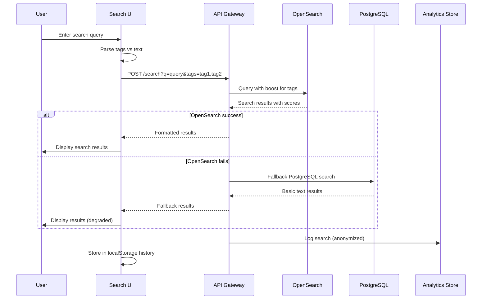
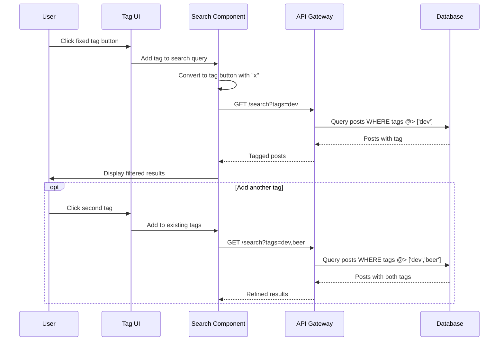
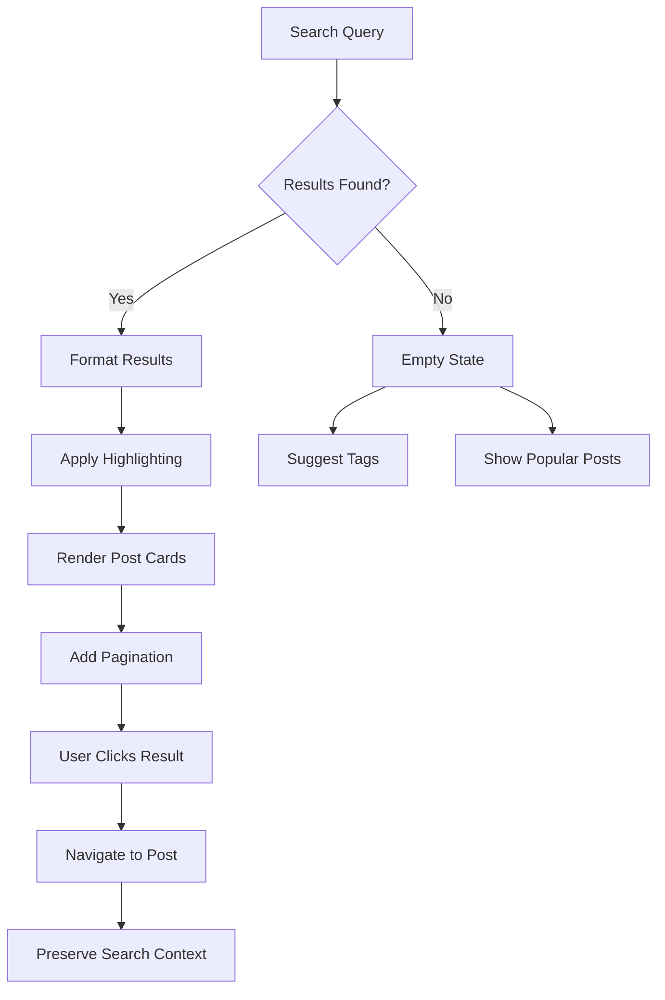
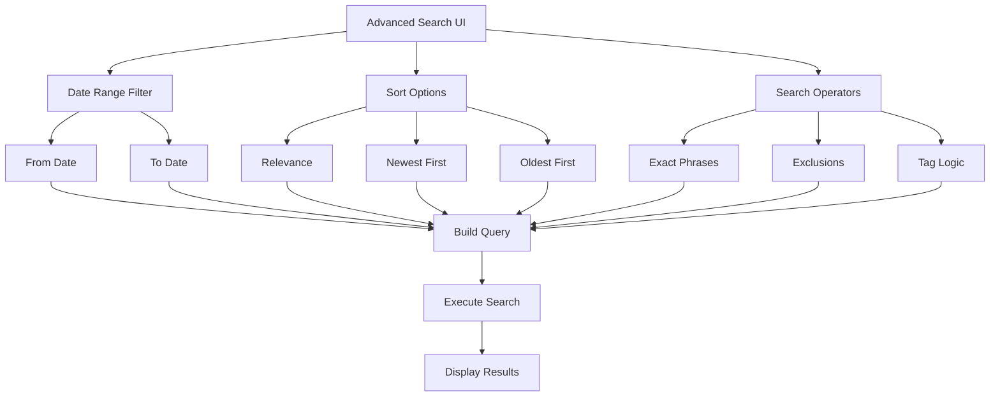

# Search & Discovery - PRD

## 📋 Domain Overview

**Domain**: Search & Discovery (`search`)  
**Responsibility**: Content search, discovery, history tracking, and analytics  
**Key Entities**: SearchQuery, SearchResult, SearchIndex, TagFilter, SearchHistory, SearchAnalytics  

**Important Note**: Search history is client-side only using localStorage for anonymous users. Only admin has server-side search analytics access.  

## 🎯 Use Cases

### UC-SD-001: Basic Content Search
**ID**: UC-SD-001  
**Name**: Search Blog Posts by Text and Tags  
**Actor**: Anonymous User / Admin  
**Trigger**: User enters search query in search bar  
**Goal**: Find relevant blog posts matching search criteria  

**Preconditions**:
- User is on home page or has access to search bar
- Search index is populated with published posts
- Search service is available

**Main Flow**:
1. User clicks on search bar on home page
2. User types search query (text or tags)
3. System detects input and shows real-time suggestions from localStorage
4. User presses Enter or clicks search button
5. System processes query (text + tag parsing)
6. System sends request to OpenSearch via API Gateway
7. OpenSearch returns ranked results based on relevance
8. System displays results with post previews
9. System tracks search for analytics (anonymized)
10. System stores search in client-side history (localStorage)

**Alternative Flows**:
- **3a**: No search history → Show placeholder text only
- **6a**: OpenSearch unavailable → Fall back to PostgreSQL full-text search
- **7a**: No results found → Display "No posts found" with suggestions
- **8a**: Search error → Display error message with retry option

**Business Rules**:
- Text search uses OpenSearch for full-text matching
- Tag search uses exact matching with "#" prefix
- Combined search: tags (AND) + text search on remaining content
- Results sorted by relevance score descending
- Maximum 20 results per page with pagination
- Search terms are case-insensitive
- Search history stored in localStorage (max 15 items)

**Security Requirements**:
- Input sanitization to prevent injection attacks
- Rate limiting: 60 searches per minute per IP
- No sensitive data in search logs
- Search analytics anonymized with hashed terms
- Client-side history only (privacy-first)

**Authorization**: Anonymous, Admin



---

### UC-SD-002: Tag-Based Search
**ID**: UC-SD-002  
**Name**: Search by Fixed and Generated Tags  
**Actor**: Anonymous User / Admin  
**Trigger**: User clicks tag button or types "#tag" in search  
**Goal**: Filter posts by specific tags  

**Preconditions**:
- User is on home page or post detail page
- Tags exist in the system
- Published posts have tags assigned

**Main Flow**:
1. User sees fixed tags in sidebar (or searches "#tag")
2. User clicks on a tag button
3. System adds tag to search bar with accent color
4. System automatically executes tag search
5. System queries posts with exact tag match
6. System displays filtered results
7. User can add more tags for refined search
8. User can remove tags using "x" button
9. System updates results in real-time

**Alternative Flows**:
- **2a**: User types "#tag" manually → Parse and convert to tag button
- **5a**: No posts with tag → Display empty state with suggestions
- **7a**: Multiple tags → Combine with AND logic

**Business Rules**:
- Fixed tags: "dev", "beer", "personal" (configurable by admin)
- Generated tags: AI-generated keywords from post content
- Tag search is exact match, case-insensitive
- Multiple tags use AND logic (intersection)
- Tag buttons have accent color and "x" remove button
- Tags persist in URL for bookmarking/sharing

**Security Requirements**:
- Tag input sanitization
- Prevent tag injection attacks
- Rate limiting on tag searches
- Tag existence validation

**Authorization**: Anonymous, Admin



---

### UC-SD-003: Search History Management
**ID**: UC-SD-003  
**Name**: Client-Side Search History with Privacy  
**Actor**: Anonymous User / Admin  
**Trigger**: User performs search or views search suggestions  
**Goal**: Provide personalized search experience while maintaining privacy  

**Preconditions**:
- Browser supports localStorage
- User has performed previous searches
- Search bar is focused for suggestions

**Main Flow**:
1. User focuses on search bar
2. System reads search history from localStorage
3. System displays recent searches as dropdown suggestions
4. User can click suggestion to repeat search
5. User performs new search
6. System adds search to localStorage history
7. System limits history to last 15 searches
8. System provides "Clear history" option in dropdown

**Alternative Flows**:
- **2a**: No search history → Show placeholder text only
- **3a**: localStorage disabled → Skip history features gracefully
- **6a**: localStorage full → Remove oldest entries first
- **8a**: User clears history → Remove all localStorage entries

**Business Rules**:
- Maximum 15 search terms in history
- History stored as: `{term, timestamp, resultCount}`
- No personal data or IP addresses stored
- History survives browser sessions
- Privacy-first: no server-side tracking
- GDPR compliant with clear disclosure

**Security Requirements**:
- Client-side only storage
- No sensitive data in localStorage
- Clear disclosure in privacy policy
- User control over data retention

**Authorization**: Anonymous, Admin

```javascript
// Implementation details for Next.js
interface SearchHistoryItem {
  term: string;
  timestamp: number;
  resultCount: number;
}

class SearchHistory {
  private static readonly MAX_ITEMS = 15;
  private static readonly STORAGE_KEY = 'nowhereland_search_history';

  static getHistory(): SearchHistoryItem[] {
    if (typeof window === 'undefined') return [];
    const stored = localStorage.getItem(this.STORAGE_KEY);
    return stored ? JSON.parse(stored) : [];
  }

  static addSearch(term: string, resultCount: number): void {
    if (typeof window === 'undefined') return;
    
    const history = this.getHistory();
    const newItem: SearchHistoryItem = {
      term: term.trim(),
      timestamp: Date.now(),
      resultCount
    };

    // Remove duplicates and add new item
    const filtered = history.filter(item => item.term !== newItem.term);
    const updated = [newItem, ...filtered].slice(0, this.MAX_ITEMS);
    
    localStorage.setItem(this.STORAGE_KEY, JSON.stringify(updated));
  }

  static clearHistory(): void {
    if (typeof window === 'undefined') return;
    localStorage.removeItem(this.STORAGE_KEY);
  }
}
```

---

### UC-SD-004: Search Result Display & Navigation
**ID**: UC-SD-004  
**Name**: Display Search Results with Rich Previews  
**Actor**: Anonymous User / Admin  
**Trigger**: Search query returns results  
**Goal**: Present search results in user-friendly format  

**Preconditions**:
- Search query has been executed
- Results are available from OpenSearch/PostgreSQL
- User is on home page or search results page

**Main Flow**:
1. System receives search results from backend
2. System formats results with post previews
3. System displays results in post list format
4. Each result shows: thumbnail, title, abstract, tags
5. User can click result to navigate to full post
6. System maintains search context for back navigation
7. System highlights search terms in results
8. User can navigate between result pages

**Alternative Flows**:
- **2a**: No results → Display empty state with search suggestions
- **4a**: No thumbnail → Show default placeholder image
- **6a**: User navigates back → Preserve search query and scroll position
- **7a**: Search term too long → Truncate highlighting appropriately

**Business Rules**:
- Results use same layout as regular post list
- Thumbnail sizes: xs: 320px, md: 480px, lg: 720px
- Abstract truncated to 2 lines with ellipsis
- Search term highlighting with accent color
- Pagination: 10 results per page
- Maintain search state in URL parameters

**Security Requirements**:
- HTML sanitization for search term highlighting
- Safe image loading with error handling
- No script injection in search results

**Authorization**: Anonymous, Admin



---

### UC-SD-005: Search Analytics (Admin Only)
**ID**: UC-SD-005  
**Name**: Admin Dashboard Search Analytics  
**Actor**: Blog Administrator  
**Trigger**: Admin accesses dashboard analytics  
**Goal**: Understand search patterns and content performance  

**Preconditions**:
- Admin is authenticated and logged in
- Search analytics data exists in database
- Admin is on dashboard page

**Main Flow**:
1. Admin navigates to dashboard analytics section
2. System queries aggregated search analytics
3. System displays search metrics with charts
4. Admin can filter by date range (7d, 30d, 90d)
5. Admin can export analytics data as CSV
6. System shows trending search terms
7. System highlights content gaps (high search, low results)
8. Admin can drill down into specific metrics

**Alternative Flows**:
- **2a**: No analytics data → Display empty state with explanation
- **4a**: Date range too large → Limit to maximum 1 year
- **5a**: Export fails → Display error and retry option

**Business Rules**:
- All search terms are hashed for privacy
- No personal identifiers stored
- Analytics aggregated daily/weekly/monthly
- Data retention: 90 days maximum
- Only admin can access analytics
- Export limited to current user's session

**Security Requirements**:
- Admin authentication required
- No raw search terms exposed
- Rate limiting on analytics queries
- Audit logging for analytics access

**Authorization**: Admin only

```typescript
// Analytics data structure
interface SearchAnalytics {
  id: string;
  search_term_hash: string; // SHA-256 hashed
  search_count: number;
  success_rate: number; // percentage with results
  avg_result_count: number;
  period_start: Date;
  period_end: Date;
  created_at: Date;
}

interface AnalyticsDashboard {
  totalSearches: number;
  uniqueSearches: number;
  avgSuccessRate: number;
  topSearchTerms: Array<{hash: string, count: number, successRate: number}>;
  contentGaps: Array<{hash: string, count: number, avgResults: number}>;
  searchTrends: Array<{date: string, searches: number}>;
}
```

---

### UC-SD-006: Advanced Search Features
**ID**: UC-SD-006  
**Name**: Advanced Search with Filters and Operators  
**Actor**: Anonymous User / Admin  
**Trigger**: User needs specific search capabilities  
**Goal**: Provide powerful search options for content discovery  

**Preconditions**:
- User understands advanced search syntax
- OpenSearch is configured for advanced queries
- Search interface supports advanced features

**Main Flow**:
1. User accesses advanced search (expandable section)
2. User can specify search filters:
   - Date range (from/to dates)
   - Content type (posts only for now)
   - Sort options (relevance, date, popularity)
3. User can use search operators:
   - Quotes for exact phrases: "web development"
   - Exclusion: -unwanted
   - Tag combinations: #dev AND #javascript
4. System builds complex OpenSearch query
5. System executes advanced search
6. System displays results with applied filters visible
7. User can modify filters and re-search

**Alternative Flows**:
- **2a**: User unfamiliar with advanced search → Show help tooltips
- **4a**: Invalid query syntax → Show syntax error with examples
- **5a**: Query too complex → Simplify or show timeout error

**Business Rules**:
- Advanced search optional feature
- Maintains backward compatibility with simple search
- Search operators follow standard conventions
- Date filters use post publication dates
- Sort options: relevance (default), newest, oldest
- Advanced features gracefully degrade if unavailable

**Security Requirements**:
- Input validation for all advanced search parameters
- Query complexity limits to prevent DoS
- Same rate limiting as basic search

**Authorization**: Anonymous (all users)



---

## 🔐 Security Policies

### Search Security Policy
- **Input Sanitization**: All search queries sanitized for injection prevention
- **Rate Limiting**: 30 searches per minute per IP address
- **Query Validation**: Length limits and character restrictions enforced
- **Result Filtering**: Only published content appears in results

### Authorization Matrix

| Resource | Anonymous | Admin |
|----------|-----------|-------|
| **Basic Search** | ✅ Use | ✅ Use |
| **Tag Search** | ✅ Use | ✅ Use |
| **Search History** | ✅ Local | ✅ Local |
| **Advanced Search** | ✅ Use | ✅ Use |
| **Search Analytics** | ❌ | ✅ Full |
| **Export Analytics** | ❌ | ✅ Limited |

### Data Protection
- **Client Storage**: localStorage for search history (privacy-first)
- **Server Analytics**: Hashed and aggregated data only
- **GDPR Compliance**: Clear cookie/storage disclosure
- **User Control**: History clearing and opt-out options

## 📊 Acceptance Criteria

### UC-SD-001 (Basic Content Search)
- [ ] Search bar accepts text input with real-time feedback
- [ ] OpenSearch integration returns relevant results
- [ ] PostgreSQL fallback works when OpenSearch unavailable
- [ ] Tag parsing correctly identifies "#tag" format
- [ ] Results display with proper formatting and pagination
- [ ] Search analytics tracking works (anonymized)
- [ ] Client-side history storage functions correctly

### UC-SD-002 (Tag Search)
- [ ] Tag buttons clickable for filtering
- [ ] Hash (#) prefix supported in search
- [ ] Multiple tags use AND logic
- [ ] Active tag filters displayed
- [ ] Tag removal functionality
- [ ] Case-insensitive tag matching

### UC-SD-003 (Search History Management)
- [ ] localStorage stores last 15 search terms
- [ ] Search suggestions appear on focus
- [ ] History clearing function works
- [ ] Privacy compliance with no server tracking
- [ ] Graceful degradation when localStorage unavailable

### UC-SD-004 (Search Result Display)
- [ ] Results use consistent post card layout
- [ ] Search term highlighting with accent color
- [ ] Thumbnail loading with fallback images
- [ ] Pagination works correctly
- [ ] Back navigation preserves search state
- [ ] Empty state displays helpful suggestions

### UC-SD-005 (Search Analytics)
- [ ] Admin dashboard shows aggregated search metrics
- [ ] Charts display search trends over time
- [ ] Content gap analysis identifies popular empty searches
- [ ] Date range filtering works (7d, 30d, 90d)
- [ ] CSV export functionality works
- [ ] Privacy compliance with hashed search terms

### UC-SD-006 (Advanced Search)
- [ ] Date range filters work correctly
- [ ] Sort options change result ordering
- [ ] Exact phrase search with quotes
- [ ] Exclusion search with minus operator
- [ ] Complex tag logic (AND/OR)
- [ ] Advanced search UI is intuitive
- [ ] Query validation with helpful error messages

## 🧪 Test Scenarios

### Security Testing
1. **Input Validation**: XSS and injection prevention
2. **Rate Limiting**: Search request throttling
3. **Privacy Compliance**: No personal data leakage
4. **Authorization**: Admin-only analytics access
5. **Data Sanitization**: Safe search term handling

### Accessibility Testing
1. **Keyboard Navigation**: Full keyboard search access
2. **Screen Readers**: Proper ARIA labels and announcements
3. **Color Contrast**: Tag highlighting meets WCAG standards
4. **Focus Management**: Clear focus indicators
5. **Error Communication**: Accessible error messages

### Performance Testing
1. **Search Speed**: OpenSearch response times < 200ms
2. **Fallback Performance**: PostgreSQL search < 500ms
3. **Client Responsiveness**: UI updates without blocking
4. **Large Result Sets**: Pagination performance
5. **Analytics Queries**: Dashboard loading times

### Functional Testing
1. **Search Flow**: Complete search from input to results
2. **Tag Integration**: Fixed and generated tag searching
3. **History Management**: localStorage operations and privacy
4. **Result Display**: Various result counts and empty states
5. **Analytics Accuracy**: Verify anonymized tracking
6. **Advanced Features**: Complex queries and filters

This search and discovery system provides comprehensive content finding capabilities while maintaining strict privacy standards and delivering powerful analytics for the blog administrator.