```mermaid
sequenceDiagram
    participant EDGE as Edge Function
    participant DB as Supabase DB
    participant RT as Realtime
    participant UI as Admin Header
    participant A as Admin
    
    EDGE->>DB: Comment flagged (status='flagged')
    DB->>RT: Notify flagged comment count change
    RT->>UI: Update badge count
    UI->>A: Show flag badge (🚩 3)
    
    A->>UI: Click admin button
    UI->>A: Highlight flagged comments option
    
    opt Admin moderates comment
        A->>DB: Approve/delete comment
        DB->>RT: Notify count decrease
        RT->>UI: Update badge count
        UI->>A: Badge count decreases
    end
```

# Comment Management & Moderation - PRD

## 📋 Domain Overview

**Domain**: Comment Management (`comment`)  
**Responsibility**: Anonymous commenting system with keyword filtering, flagging, and moderation  
**Key Entities**: Comment, CommentReply, CommentFlag, FilterKeyword, CommentModeration  

**Important Note**: Anonymous guest book-style comments with username/password. Only admin can moderate. Flagged comments hidden from public but visible to admin with flag UI indicator.

## 🎯 Use Cases

### UC-CM-001: Submit Anonymous Comment
**ID**: UC-CM-001  
**Name**: Submit Comment on Blog Post  
**Actor**: Anonymous User  
**Trigger**: User wants to leave comment on post  
**Goal**: Successfully submit comment for moderation review  

**Preconditions**:
- User is on blog post detail page
- Post allows comments
- Comment form is displayed

**Main Flow**:
1. User scrolls to comment section on post page
2. User fills comment form (nickname, password, content)
3. User clicks "Submit" button
4. System validates input (required fields, length limits)
5. System hashes password for future edit/delete capability
6. System triggers Supabase Edge Function for content filtering
7. Edge Function checks content against admin-configured keywords
8. If keywords detected → Status set to 'flagged'
9. If clean → Status set to 'approved'
10. System saves comment to database with appropriate status
11. System displays success message
12. Approved comments appear immediately, flagged ones are hidden

**Alternative Flows**:
- **4a**: Validation fails → Display error messages
- **7a**: Content contains filtered keywords → Auto-flag comment
- **10a**: Database error → Display retry message

**Business Rules**:
- Nickname: 2-50 characters, required
- Password: 4-100 characters, required (for edit/delete)
- Content: 10-2000 characters, required
- Password hashed with bcrypt before storage
- Flagged comments invisible to anonymous users
- Approved comments visible immediately
- All comments linked to specific post

**Security Requirements**:
- Input sanitization for XSS prevention
- Password hashing (bcrypt)
- Rate limiting: 5 comments per IP per hour
- Content filtering via Edge Function
- No script injection in comment content

**Authorization**: Anonymous

---

### UC-CM-002: Edit/Delete Own Comment
**ID**: UC-CM-002  
**Name**: Modify Own Comment with Password  
**Actor**: Anonymous User (Comment Author)  
**Trigger**: User wants to edit or delete their comment  
**Goal**: Modify or remove previously submitted comment  

**Preconditions**:
- User's comment exists on the post
- User remembers their password
- Comment is not already deleted

**Main Flow**:
1. User clicks "Edit" or "Delete" button on their comment
2. System displays password modal
3. User enters password and confirms action
4. System validates password against stored hash
5. For Edit: System displays editable comment form
6. For Delete: System displays confirmation dialog
7. User submits changes or confirms deletion
8. System processes request (same filtering for edits)
9. System updates comment status/content in database
10. System displays updated comment or removes it

**Alternative Flows**:
- **4a**: Wrong password → Display "Incorrect password" error
- **8a**: Edit contains filtered keywords → Flag the comment
- **9a**: Database error → Display retry message

**Business Rules**:
- Only original author can edit/delete (password verification)
- Edited comments go through same filtering process
- Delete is soft delete (status = 'deleted')
- Edit history not tracked (simple overwrite)
- Deleted comments show "This comment was deleted"
- Password attempts rate limited

**Security Requirements**:
- Password verification required
- Rate limiting on password attempts
- Same content filtering for edits
- Audit logging for edit/delete actions

**Authorization**: Comment Author (password verified)

---

### UC-CM-003: Reply to Comment (1 Depth)
**ID**: UC-CM-003  
**Name**: Reply to Existing Comment  
**Actor**: Anonymous User  
**Trigger**: User wants to reply to a comment  
**Goal**: Submit reply to specific comment (max 1 level deep)  

**Preconditions**:
- Parent comment exists and is approved
- Post allows comments
- Reply is not to another reply (1 depth limit)

**Main Flow**:
1. User clicks "Reply" button on a parent comment
2. System displays reply form under the parent comment
3. User fills reply form (nickname, password, content)
4. User clicks "Submit Reply" button
5. System validates input and parent comment eligibility
6. System triggers same content filtering as regular comments
7. System saves reply with parent_comment_id reference
8. System displays reply nested under parent comment
9. Reply appears with visual indentation and "Reply to @nickname"

**Alternative Flows**:
- **5a**: Parent comment not found → Display error
- **5b**: Parent is already a reply → Disable reply (1 depth limit)
- **6a**: Content flagged → Hide reply from public view

**Business Rules**:
- Maximum 1 level of nesting (replies to replies not allowed)
- Reply inherits same validation as parent comments
- Replies visually indented and marked as "Reply to @nickname"
- Same content filtering and moderation rules apply
- Replies can be edited/deleted by author using password
- If parent comment deleted, replies remain but show orphaned state

**Security Requirements**:
- Same security measures as regular comments
- Parent comment ID validation
- Depth limit enforcement
- Content filtering via Edge Function

**Authorization**: Anonymous

---

### UC-CM-004: Admin Keyword Management
**ID**: UC-CM-004  
**Name**: Configure Content Filtering Keywords  
**Actor**: Blog Administrator  
**Trigger**: Admin wants to update comment filtering rules  
**Goal**: Manage list of keywords that trigger comment flagging  

**Preconditions**:
- Admin is logged in
- Admin is on admin settings page

**Main Flow**:
1. Admin navigates to Admin Settings → Comment Moderation
2. System displays current keyword filtering configuration
3. System shows list of existing filter keywords with remove buttons
4. Admin can add new keywords using text input
5. Admin can remove existing keywords by clicking "X" button
6. Admin can toggle case-sensitive matching option
7. Admin clicks "Save Changes" to update configuration
8. System validates keywords (no empty strings, reasonable length)
9. System updates keyword list in database
10. System shows success message and updated list

**Alternative Flows**:
- **8a**: Invalid keywords → Display validation errors
- **9a**: Save fails → Display error and allow retry

**Business Rules**:
- Keywords are case-insensitive by default (configurable)
- Minimum keyword length: 2 characters
- Maximum keyword length: 50 characters
- Maximum 100 keywords total
- Keywords can include wildcards (* for partial matching)
- Changes apply to new comments immediately
- Existing comments not retroactively filtered

**Security Requirements**:
- Admin authentication required
- Input validation for keywords
- No script injection in keyword strings
- Audit logging of keyword changes

**Authorization**: Admin only

---

### UC-CM-005: Admin Flag Review & Moderation
**ID**: UC-CM-005  
**Name**: Review and Moderate Flagged Comments  
**Actor**: Blog Administrator  
**Trigger**: Admin checks flagged comments for moderation  
**Goal**: Review flagged comments and approve or delete them  

**Preconditions**:
- Admin is logged in
- Flagged comments exist in system
- Admin is on moderation dashboard

**Main Flow**:
1. Admin navigates to Admin Settings → Flagged Comments
2. System displays list of flagged comments with context:
   - Comment content and author
   - Associated blog post title
   - Flagging reason (keyword match)
   - Timestamp
3. Admin can see flag indicator (🚩) next to each flagged comment
4. For each comment, admin can choose:
   - "Approve" - Remove flag, make visible to public
   - "Delete" - Soft delete comment permanently
   - "Keep Flagged" - Leave as flagged (hidden from public)
5. Admin clicks action button for each comment
6. System processes moderation decision
7. System updates comment status in database
8. System removes processed comments from flagged list
9. System logs moderation action for audit

**Alternative Flows**:
- **2a**: No flagged comments → Display empty state message
- **6a**: Processing fails → Display error and allow retry

**Business Rules**:
- Flagged comments invisible to anonymous users
- Admin can see all comments regardless of status
- Approved comments become immediately visible
- Deleted comments are soft deleted (audit trail preserved)
- Flagged status can be maintained indefinitely
- Batch actions available for efficiency

**Security Requirements**:
- Admin authentication required
- Audit logging of all moderation actions
- Comment content sanitization in admin interface
- Action confirmation for bulk operations

**Authorization**: Admin only

---

### UC-CM-006: Admin Comment Flag Notification
**ID**: UC-CM-006  
**Name**: Notify Admin of New Flagged Comments  
**Actor**: System  
**Trigger**: Comment gets flagged by content filter  
**Goal**: Alert admin that manual review is needed  

**Preconditions**:
- Admin is logged in
- New comment has been flagged
- Notification system is active

**Main Flow**:
1. System detects new flagged comment via Edge Function
2. System increments flagged comment counter
3. System displays flag notification badge on admin header
4. Badge shows number of pending flagged comments (max 99+)
5. Admin clicks on "Admin" button to see notification
6. Clicking badge navigates to flagged comments page
7. After admin reviews comments, counter decreases
8. Badge disappears when no flagged comments remain

**Alternative Flows**:
- **3a**: Admin not online → Badge appears next login
- **7a**: Multiple admins → Real-time sync via Supabase Realtime

**Business Rules**:
- Badge shows count of flagged comments needing review
- Maximum displayed count: 99+ for large numbers
- Real-time updates when new comments flagged
- Badge persists across browser sessions
- Counter updates when comments approved/deleted

**Security Requirements**:
- Only admin sees notification badge
- Real-time updates use secure WebSocket connection
- Badge count doesn't reveal comment content

**Authorization**: Admin only

---

## 🔐 Security Policies

### Comment Security Policy
- **Input Validation**: All comment content sanitized for XSS
- **Rate Limiting**: 5 comments per IP per hour
- **Password Security**: bcrypt hashing for comment passwords
- **Content Filtering**: Real-time keyword filtering via Edge Functions

### Moderation Security Policy
- **Admin Access**: Only authenticated admin can moderate
- **Audit Logging**: All moderation actions logged
- **Data Integrity**: Soft delete preserves audit trail
- **Real-time Security**: Secure WebSocket for notifications

### Authorization Matrix

| Resource | Anonymous | Admin |
|----------|-----------|-------|
| **Submit Comment** | ✅ Create | ✅ Create |
| **Edit Own Comment** | ✅ Password | ✅ Full |
| **Delete Own Comment** | ✅ Password | ✅ Full |
| **Reply to Comment** | ✅ Create | ✅ Create |
| **View Flagged Comments** | ❌ | ✅ Full |
| **Moderate Comments** | ❌ | ✅ Full |
| **Configure Keywords** | ❌ | ✅ Full |
| **Flag Notifications** | ❌ | ✅ View |

### Data Protection
- **Password Storage**: bcrypt hashed, never plain text
- **Content Filtering**: Edge Function processing
- **Audit Trail**: Comprehensive logging of all actions
- **Privacy**: Anonymous commenting with minimal data collection

## 📊 Acceptance Criteria

### UC-CM-001 (Submit Comment)
- [ ] Comment form accepts nickname, password, content
- [ ] Password hashed before database storage
- [ ] Content filtering via Supabase Edge Function
- [ ] Flagged comments hidden from anonymous users
- [ ] Approved comments visible immediately
- [ ] Rate limiting prevents spam (5 per hour per IP)

### UC-CM-002 (Edit/Delete Comment)
- [ ] Password verification required for edit/delete
- [ ] Edit form pre-populated with existing content
- [ ] Edited comments go through same filtering
- [ ] Delete is soft delete with audit trail
- [ ] Password attempts are rate limited

### UC-CM-003 (Reply System)
- [ ] Reply button available on parent comments only
- [ ] 1-level depth limit enforced
- [ ] Replies visually nested with indentation
- [ ] "Reply to @nickname" indicator shown
- [ ] Same filtering and moderation as parent comments

### UC-CM-004 (Keyword Management)
- [ ] Admin can add/remove filter keywords
- [ ] Case-sensitive option configurable
- [ ] Keyword validation prevents empty/long strings
- [ ] Changes apply to new comments immediately
- [ ] Maximum 100 keywords supported

### UC-CM-005 (Flag Moderation)
- [ ] Flagged comments list shows content and context
- [ ] Approve/Delete/Keep Flagged actions work
- [ ] Status changes update comment visibility
- [ ] Moderation actions logged for audit
- [ ] Empty state shown when no flagged comments

### UC-CM-006 (Flag Notifications)
- [ ] Badge shows count of flagged comments
- [ ] Real-time updates via Supabase Realtime
- [ ] Badge disappears when no flags remain
- [ ] Clicking badge navigates to moderation page
- [ ] Count updates when comments moderated

## 🧪 Test Scenarios

### Functional Testing
1. **Comment Lifecycle**: Submit → Flag → Moderate → Display
2. **Reply Threading**: Parent-child relationships and depth limits
3. **Password Authentication**: Comment edit/delete verification
4. **Keyword Filtering**: Various keyword patterns and matching
5. **Admin Moderation**: Complete flagged comment workflow
6. **Real-time Notifications**: Badge updates and synchronization

### Security Testing
1. **Input Validation**: XSS and injection prevention in comments
2. **Rate Limiting**: Comment spam prevention
3. **Password Security**: bcrypt hashing and verification
4. **Authorization**: Admin-only access to moderation features
5. **Content Filtering**: Edge Function security and reliability

### Performance Testing
1. **Comment Loading**: Large comment threads performance
2. **Real-time Updates**: Notification badge responsiveness
3. **Edge Function**: Content filtering response times
4. **Database Queries**: Efficient comment retrieval with status
5. **Nested Replies**: Reply rendering performance

### User Experience Testing
1. **Anonymous UX**: Intuitive commenting without registration
2. **Password Recovery**: Clear messaging for forgotten passwords
3. **Visual Threading**: Reply nesting and relationship clarity
4. **Admin Workflow**: Efficient moderation interface
5. **Mobile Experience**: Comment forms and threading on mobile

This comment management system provides a complete anonymous commenting solution with robust moderation capabilities, all built on your existing Supabase infrastructure.