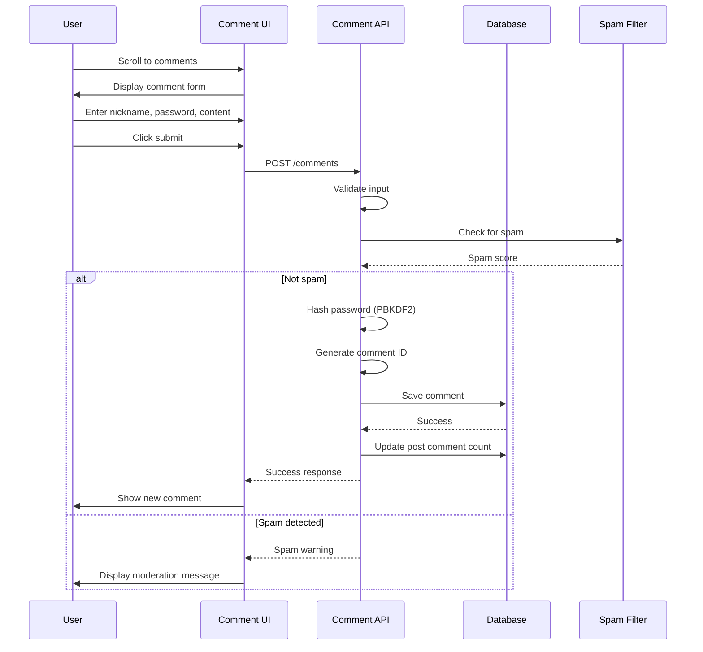
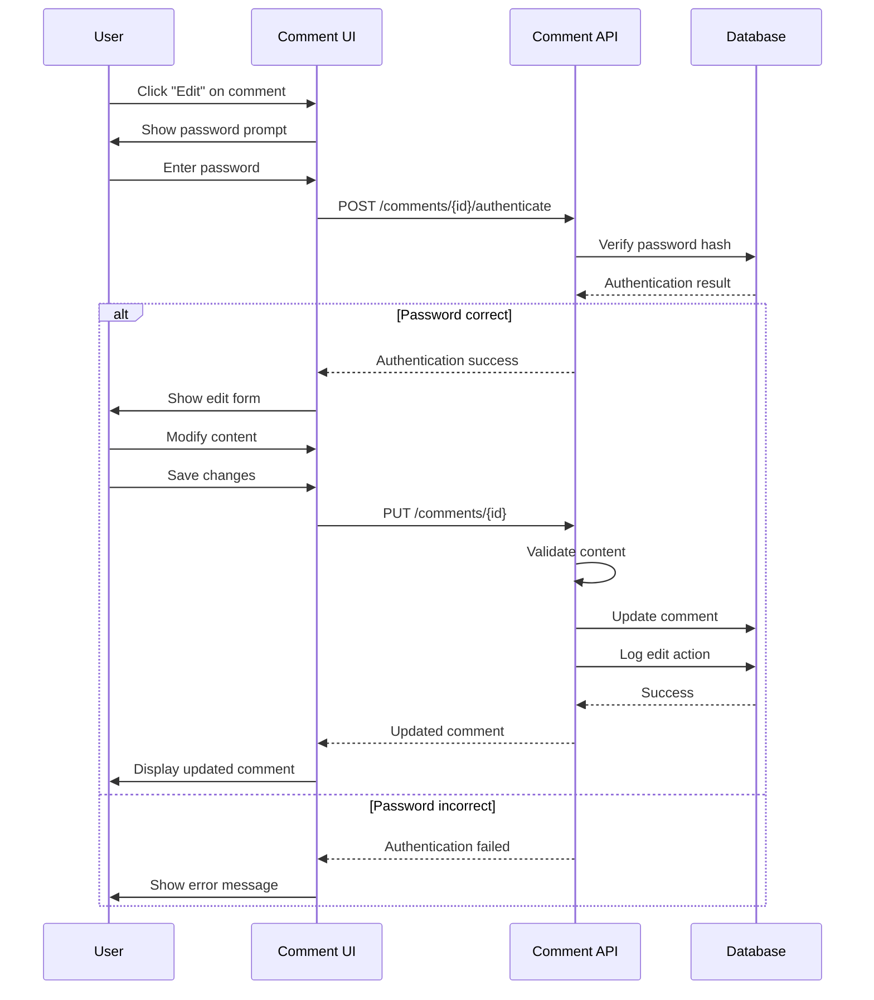
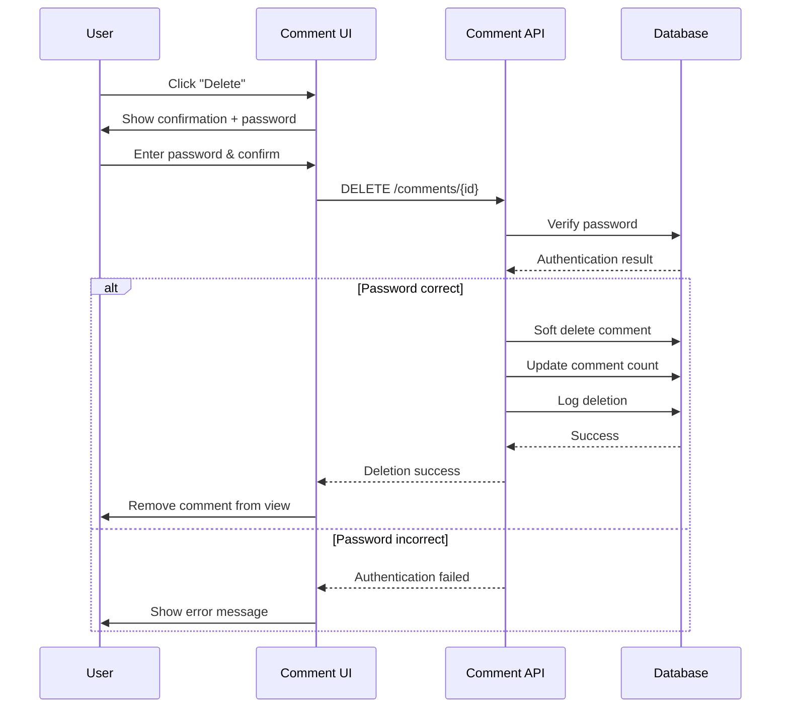
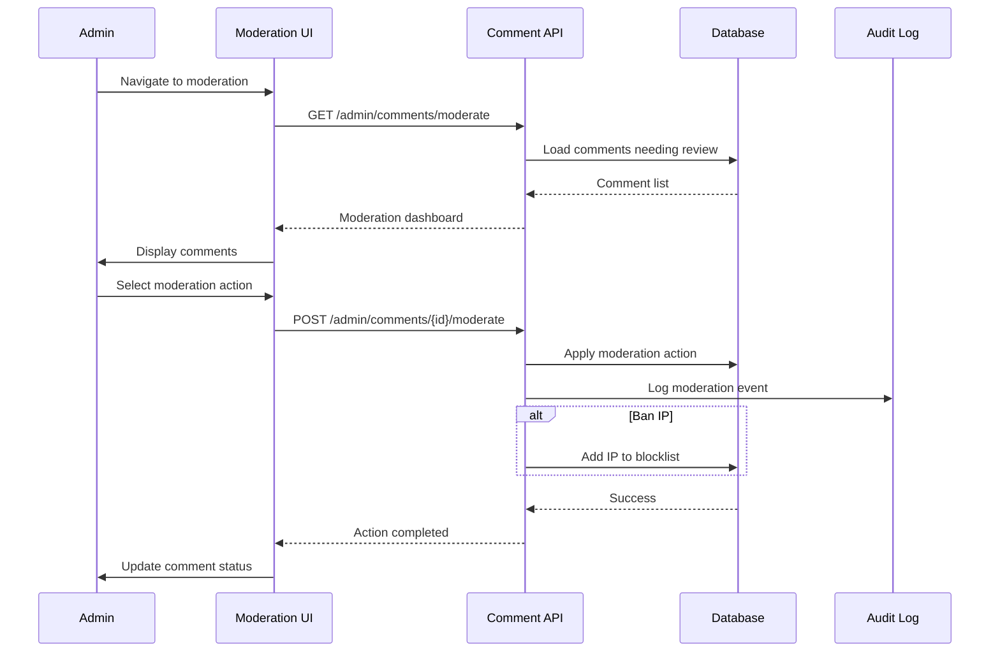
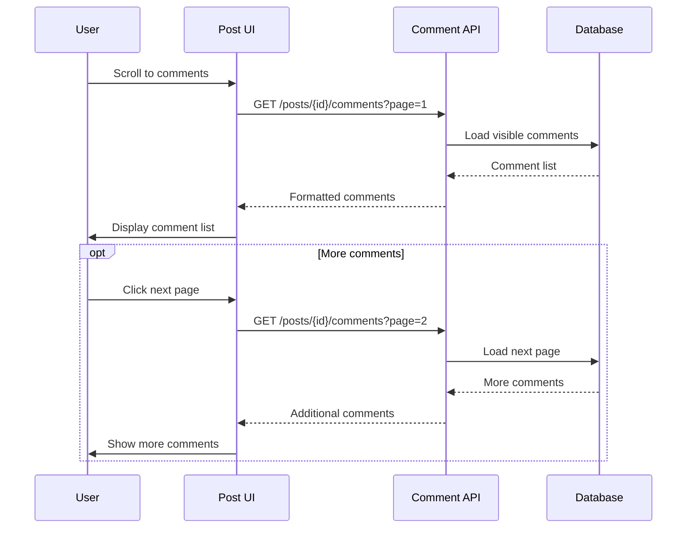
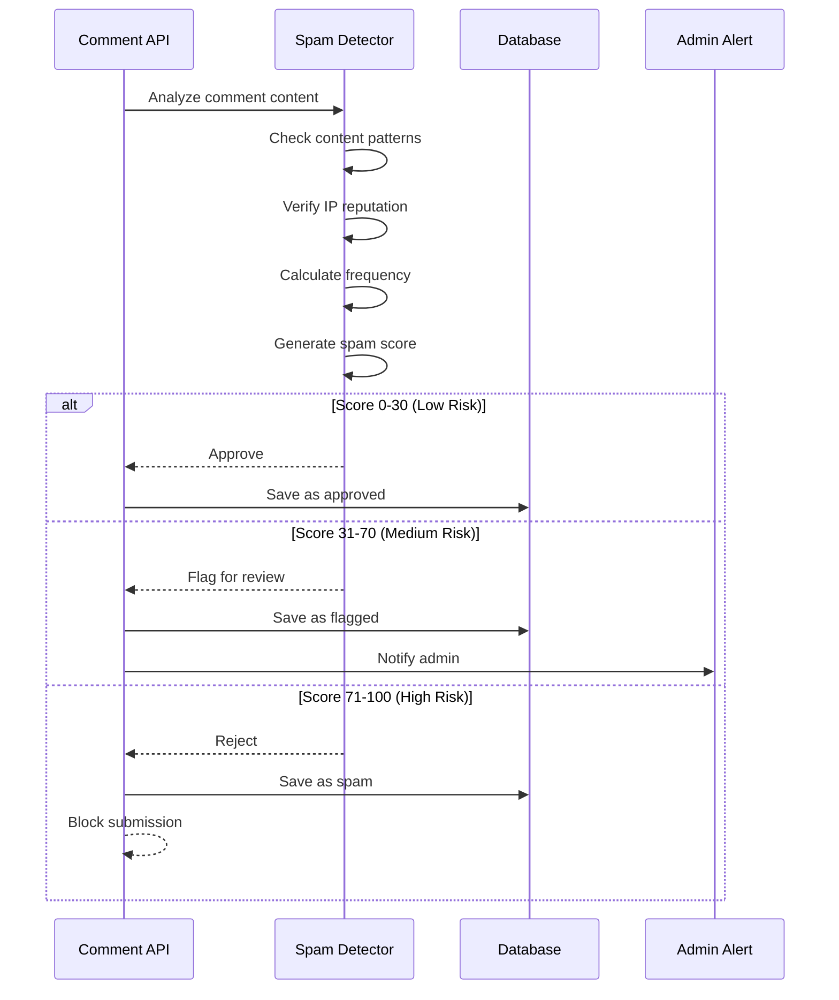

# Comment System - PRD

## 📋 Domain Overview

**Domain**: Comment System (`comment`)  
**Responsibility**: Anonymous commenting with per-comment authentication and moderation  
**Key Entities**: Comment, CommentThread, CommentAuth, ModerationAction  

**Important Note**: This is an anonymous comment system similar to a guest book. Users don't register - they provide username/password per comment for future modifications. Admin can comment without credentials when logged in.

## 🎯 Use Cases

### UC-CS-001: Submit Anonymous Comment
**ID**: UC-CS-001  
**Name**: Submit Anonymous Comment  
**Actor**: Anonymous User / Admin  
**Trigger**: User wants to comment on a blog post  
**Goal**: Add a comment to a blog post with anonymous authentication  

**Preconditions**:
- Blog post exists and is published
- Comments are enabled for the post
- User is on post detail page

**Main Flow**:
1. User scrolls to comment section at bottom of post
2. System displays comment input form
3. User enters nickname (display name)
4. User enters password (for future comment management)
5. User writes comment content in text area
6. User clicks "Submit Comment" button
7. System validates input fields (all required)
8. System hashes password with PBKDF2
9. System generates unique comment ID using nanoid
10. System saves comment with "pending" status
11. System displays success message
12. System shows comment immediately (no moderation queue)
13. System updates comment count for the post

**Alternative Flows**:
- **3a**: Admin is logged in → Skip nickname/password fields, use admin identity
- **7a**: Missing required fields → Display validation errors
- **7b**: Comment too long → Display length limit error
- **9a**: Spam detection triggered → Flag for admin review

**Business Rules**:
- Maximum comment length: 2000 characters
- Nickname must be 2-50 characters
- Password must be 8-64 characters (same as admin password rules)
- Comments are immediately visible (no approval queue)
- Each comment has unique nanoid (10 characters)
- Admin comments are marked with special badge

**Security Requirements**:
- Comment content must be sanitized for XSS
- Password hashed with PBKDF2 (10,000+ iterations)
- Rate limiting: 5 comments per IP per hour
- Basic spam detection (repeated content, excessive links)
- HTML tags stripped except safe formatting

**Authorization**: Anonymous, Admin

---

### UC-CS-002: Edit Comment
**ID**: UC-CS-002  
**Name**: Edit Existing Comment  
**Actor**: Anonymous User / Admin  
**Trigger**: User wants to modify their previously submitted comment  
**Goal**: Update comment content with proper authentication  

**Preconditions**:
- Comment exists in the system
- User knows the comment password (or is admin)
- Comment is not older than edit time limit (24 hours)

**Main Flow**:
1. User clicks "Edit" button on their comment
2. System displays password prompt modal
3. User enters the password used when creating comment
4. System validates password against stored hash
5. System displays comment edit form with current content
6. User modifies comment content
7. User clicks "Save Changes" button
8. System validates updated content
9. System saves changes with update timestamp
10. System displays updated comment
11. System shows "edited" indicator on comment

**Alternative Flows**:
- **3a**: Admin is logged in → Skip password prompt
- **4a**: Wrong password → Display error, allow retry (3 attempts max)
- **6a**: No changes made → Close edit form without saving
- **8a**: Content validation fails → Show error message

**Business Rules**:
- Comments can be edited within 24 hours of creation
- Edit history is tracked but not displayed publicly
- Admin can edit any comment without time restrictions
- Edited comments show "edited" timestamp
- Same content validation rules apply as creation

**Security Requirements**:
- Password verification required for non-admin edits
- Edit attempts must be rate limited
- Content sanitization on updates
- Edit history logged for audit

**Authorization**: Anonymous (with password), Admin

---

### UC-CS-003: Delete Comment
**ID**: UC-CS-003  
**Name**: Delete Comment  
**Actor**: Anonymous User / Admin  
**Trigger**: User wants to remove their comment  
**Goal**: Remove comment from public view while preserving audit trail  

**Preconditions**:
- Comment exists in the system
- User knows the comment password (or is admin)
- Comment is not older than delete time limit (24 hours for users)

**Main Flow**:
1. User clicks "Delete" button on their comment
2. System displays confirmation dialog with password prompt
3. User enters password and confirms deletion
4. System validates password against stored hash
5. System displays final confirmation ("Are you sure?")
6. User confirms deletion
7. System soft-deletes comment (status = "deleted")
8. System decrements post comment count
9. System removes comment from public view
10. System displays deletion success message
11. System logs deletion action for audit

**Alternative Flows**:
- **3a**: Admin is logged in → Skip password prompt
- **4a**: Wrong password → Display error message
- **6a**: User cancels → Return to comment view without changes

**Business Rules**:
- Users can delete comments within 24 hours
- Admin can delete any comment at any time
- Deleted comments are soft-deleted (preserved for audit)
- Comment count is updated when comments are deleted
- Deletion is immediate and irreversible
- Child comments (if threading added) are also hidden

**Security Requirements**:
- Password verification required for user deletions
- Deletion attempts must be logged
- Soft delete preserves evidence
- Admin deletions bypass time restrictions

**Authorization**: Anonymous (with password), Admin

---

### UC-CS-004: Moderate Comments (Admin)
**ID**: UC-CS-004  
**Name**: Administrative Comment Moderation  
**Actor**: Blog Administrator  
**Trigger**: Admin reviews flagged comments or performs moderation actions  
**Goal**: Manage comment quality and handle spam/inappropriate content  

**Preconditions**:
- Admin is authenticated
- Comments exist in the system
- Admin is on comment moderation page

**Main Flow**:
1. Admin navigates to comment moderation dashboard
2. System displays list of comments with moderation options
3. System shows flagged comments, recent comments, and spam queue
4. Admin reviews comment content and context
5. Admin selects moderation action (approve, flag, delete, ban IP)
6. System applies selected action
7. System updates comment status accordingly
8. System logs moderation action with timestamp
9. System sends notification to affected users (if configured)
10. System updates moderation statistics

**Alternative Flows**:
- **5a**: Bulk moderation → Select multiple comments for same action
- **6a**: Ban IP address → Add IP to blocklist for future prevention
- **9a**: No notifications configured → Skip notification step

**Business Rules**:
- Admin can perform any moderation action on any comment
- Moderation actions are immediately effective
- Banned IPs cannot submit new comments
- Moderation history is preserved for audit
- Bulk actions are limited to 50 comments at once

**Security Requirements**:
- Only admin can access moderation features
- All moderation actions must be logged
- IP banning affects future comment submissions
- Moderation logs include full context

**Authorization**: Admin

---

### UC-CS-005: View Comments
**ID**: UC-CS-005  
**Name**: View Comment List  
**Actor**: Anonymous User / Admin  
**Trigger**: User views blog post with comments  
**Goal**: Display comments in readable, organized format  

**Preconditions**:
- User is on published blog post page
- Post has comments enabled
- Comments exist for the post

**Main Flow**:
1. User scrolls to comment section below post content
2. System loads comments for the current post
3. System displays comments sorted by timestamp (oldest first)
4. System shows comment count at top of section
5. System displays each comment with metadata
6. System shows edit/delete buttons for user's own comments
7. System implements pagination if more than 20 comments
8. User can navigate between comment pages
9. System updates URL with comment page anchor

**Alternative Flows**:
- **3a**: No comments → Show "No comments yet" message
- **7a**: Less than 20 comments → No pagination needed
- **6a**: Admin logged in → Show moderation actions on all comments

**Business Rules**:
- Comments sorted by creation time (chronological)
- 20 comments per page maximum
- Comment metadata includes: nickname, timestamp, edit indicator
- Admin comments have special visual indicator
- Deleted comments are not displayed
- Comment count reflects only visible comments

**Security Requirements**:
- Only published, non-deleted comments are shown
- User passwords are never displayed
- Comment content is properly escaped for display
- Edit/delete buttons only shown to authorized users

**Authorization**: Anonymous, Admin

---

### UC-CS-006: Comment Spam Detection
**ID**: UC-CS-006  
**Name**: Automatic Spam Detection  
**Actor**: System  
**Trigger**: New comment is submitted  
**Goal**: Automatically detect and flag potential spam comments  

**Preconditions**:
- Comment submission is in progress
- Spam detection service is available
- Comment content exists

**Main Flow**:
1. System receives new comment submission
2. System analyzes comment content for spam indicators
3. System checks IP address against known spam sources
4. System evaluates comment frequency from same IP
5. System calculates spam probability score
6. System applies threshold-based decision
7. If low risk: comment is approved automatically
8. If medium risk: comment is flagged for review
9. If high risk: comment is rejected or heavily flagged
10. System logs spam detection results

**Alternative Flows**:
- **2a**: Content analysis service unavailable → Use basic keyword filtering
- **8a**: Medium risk + admin available → Notify admin immediately
- **9a**: High risk from known good user → Override to medium risk

**Business Rules**:
- Spam scores: 0-30 (approve), 31-70 (flag), 71-100 (reject)
- Known good IPs get score reduction
- Repeated content gets higher spam score
- Excessive links increase spam probability
- Admin can override spam decisions

**Security Requirements**:
- Spam detection must not block legitimate comments
- False positive rate should be under 5%
- Spam detection results logged for improvement
- Admin can review and adjust spam settings

**Authorization**: System

---

## 🔐 Security Policies

### Comment Security Policy
- **Input Validation**: All comment content sanitized for XSS prevention
- **Password Security**: PBKDF2 hashing with 10,000+ iterations
- **Rate Limiting**: 5 comments per IP per hour, 3 edit attempts per comment
- **Spam Prevention**: Multi-layer spam detection with admin override

### Authorization Matrix

| Resource | Anonymous | Admin | System |
|----------|-----------|-------|--------|
| View Comments | ✅ Read | ✅ Read | ✅ Read |
| Submit Comment | ✅ Write | ✅ Write | ❌ |
| Edit Own Comment | ✅ Write* | ✅ Write | ❌ |
| Delete Own Comment | ✅ Write* | ✅ Write | ❌ |
| Moderate Comments | ❌ | ✅ Full | ❌ |
| View Spam Queue | ❌ | ✅ Read | ✅ Read |
| Comment Settings | ❌ | ✅ Full | ✅ Read |

*Requires password verification

### Data Protection
- **Password Storage**: PBKDF2 with random salt, never reversible
- **Comment History**: Edit/delete actions logged for audit
- **IP Logging**: IP addresses logged for spam prevention (GDPR compliant)
- **Data Retention**: Soft-deleted comments retained for 90 days

## 📊 Acceptance Criteria

### UC-CS-001 (Submit Comment)
- [ ] Comment form accessible on all published posts
- [ ] Nickname and password required for anonymous users
- [ ] Admin can comment without credentials when logged in
- [ ] Content length validation enforced (2000 chars max)
- [ ] Comments immediately visible after submission
- [ ] Comment count updated automatically

### UC-CS-002 (Edit Comment)
- [ ] Edit button only visible on user's own comments
- [ ] Password required for anonymous user edits
- [ ] 24-hour edit window enforced for regular users
- [ ] Admin can edit any comment at any time
- [ ] "Edited" indicator shown on modified comments
- [ ] Edit history tracked in database

### UC-CS-003 (Delete Comment)
- [ ] Delete requires password confirmation
- [ ] Soft delete preserves comment data
- [ ] Comment removed from public view immediately
- [ ] Comment count decremented
- [ ] Admin can delete any comment
- [ ] Deletion logged for audit

### UC-CS-004 (Moderate Comments)
- [ ] Moderation dashboard accessible to admin only
- [ ] Bulk moderation actions supported
- [ ] IP banning functionality
- [ ] All moderation actions logged
- [ ] Flagged comments clearly identified

### UC-CS-005 (View Comments)
- [ ] Comments sorted chronologically
- [ ] Pagination for posts with 20+ comments
- [ ] Admin comments visually distinguished
- [ ] Edit/delete buttons shown appropriately
- [ ] Comment count displayed accurately

### UC-CS-006 (Spam Detection)
- [ ] Automatic spam scoring on submission
- [ ] Three-tier risk classification
- [ ] Admin notifications for flagged content
- [ ] Spam detection logs maintained
- [ ] Admin can override spam decisions

## 🧪 Test Scenarios

### Security Testing
1. **XSS Prevention**: Submit comments with script tags, verify sanitization
2. **Password Security**: Verify PBKDF2 hashing, salt uniqueness
3. **Rate Limiting**: Test comment submission rate limits
4. **Authorization**: Verify edit/delete restrictions
5. **Admin Bypass**: Test admin privilege escalation

### Functional Testing
1. **Comment Lifecycle**: Create, edit, delete comment workflow
2. **Anonymous vs Admin**: Different user type behaviors
3. **Spam Detection**: Various spam scenarios and responses
4. **Moderation Workflow**: Admin moderation actions
5. **Error Handling**: Invalid input, network errors, timeouts

### Performance Testing
1. **Comment Loading**: Page load with 100+ comments
2. **Pagination**: Navigation through multiple comment pages
3. **Spam Detection**: Processing time for spam analysis
4. **Database Load**: Concurrent comment submissions
5. **Memory Usage**: Comment storage efficiency

This comment system provides a simple, secure guest book-style commenting experience while giving the admin full control over content moderation and user experience.