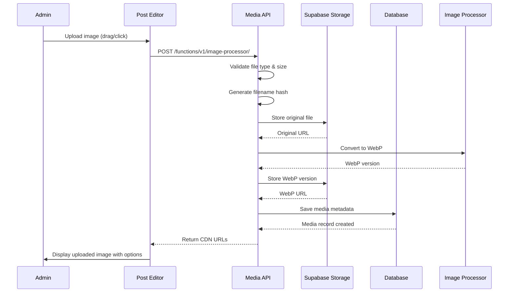
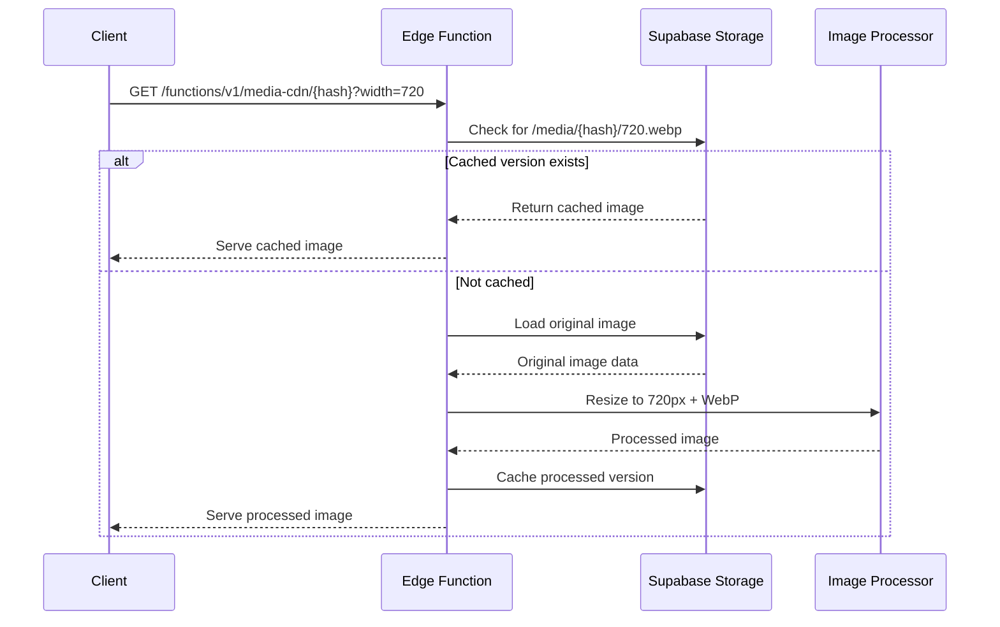
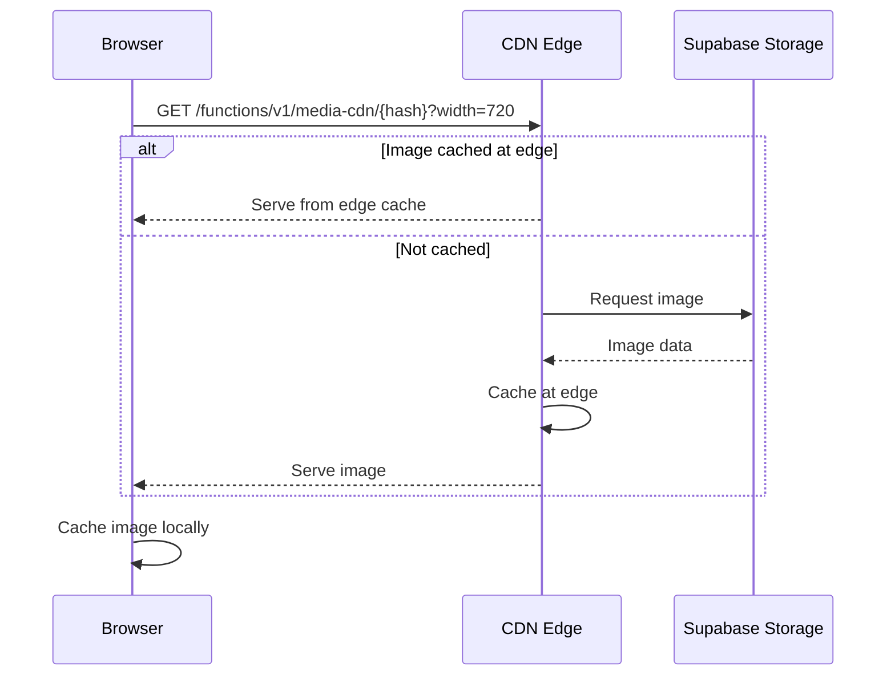

# Media Management - PRD

## 📋 Domain Overview

**Domain**: Media Management (`media`)  
**Responsibility**: Image upload, processing, storage, and CDN delivery  
**Key Entities**: MediaAsset, ProcessedImage, Thumbnail, ImageMetadata  

## 🎯 Use Cases

### UC-MM-001: Upload Image
**ID**: UC-MM-001  
**Name**: Upload Image to Post  
**Actor**: Blog Administrator  
**Trigger**: Admin uploads image while writing/editing post  
**Goal**: Process and store image for use in blog post  

**Preconditions**:
- Admin is authenticated
- Admin is on post editor page
- Image file meets format and size requirements

**Main Flow**:
1. Admin drags image file to editor or clicks file picker
2. System validates file type (JPG, PNG, GIF, WebP only)
3. System validates file size (max 5MB)
4. System generates hash of filename for unique identification
5. System uploads original file to Supabase Storage
6. System stores original at `/media/{hash}/original`
7. System generates WebP version at original dimensions
8. System stores WebP at `/media/{hash}/{original_width}.webp`
9. System creates media record in database
10. System returns CDN URLs for editor insertion
11. System enables "Set as Thumbnail" option for image

**Alternative Flows**:
- **2a**: Invalid file type → Display format error message
- **3a**: File too large → Display size limit error
- **4a**: Hash collision → Append timestamp to ensure uniqueness
- **7a**: WebP conversion fails → Log error, use original format

**Business Rules**:
- Supported formats: JPG, JPEG, PNG, GIF, WebP
- Maximum file size: 5MB
- Original files are always preserved
- Hash-based naming prevents conflicts
- WebP conversion for optimization
- Each image can be designated as post thumbnail

**Security Requirements**:
- File type validation by magic numbers, not just extension
- MIME type whitelist enforcement
- File size limits to prevent abuse
- Access control via Supabase RLS policies
- No executable file uploads allowed

**File Validation Implementation**:
```javascript
// Basic file validation for personal blog
const validateUploadedFile = (file) => {
  // MIME type whitelist
  const allowedTypes = [
    'image/jpeg', 'image/jpg', 'image/png', 
    'image/gif', 'image/webp'
  ];
  
  // Size limit (5MB)
  const maxSize = 5 * 1024 * 1024;
  
  // Basic validation
  if (!allowedTypes.includes(file.type)) {
    throw new Error('Invalid file type. Only images allowed.');
  }
  
  if (file.size > maxSize) {
    throw new Error('File too large. Maximum size is 5MB.');
  }
  
  return true;
};

// Magic number validation (Edge Function)
const validateMagicNumbers = (buffer) => {
  const magicNumbers = {
    'jpeg': [0xFF, 0xD8, 0xFF],
    'png': [0x89, 0x50, 0x4E, 0x47],
    'gif': [0x47, 0x49, 0x46],
    'webp': [0x52, 0x49, 0x46, 0x46]
  };
  
  const header = new Uint8Array(buffer.slice(0, 8));
  
  for (const [type, signature] of Object.entries(magicNumbers)) {
    if (signature.every((byte, i) => header[i] === byte)) {
      return type;
    }
  }
  
  throw new Error('File signature does not match expected image format');
};
```

**Validation Benefits**:
- Prevents malicious file uploads (`.exe` disguised as `.jpg`)
- Stops file type spoofing attacks
- Ensures storage efficiency with size limits
- Simple implementation for personal blog use case
- No complex infrastructure needed

**Authorization**: Admin



---

### UC-MM-002: Process Image for Display
**ID**: UC-MM-002  
**Name**: Dynamic Image Processing  
**Actor**: System / CDN  
**Trigger**: Request for image at specific width  
**Goal**: Serve optimized image at requested dimensions  

**Preconditions**:
- Original image exists in storage
- Valid width parameter provided
- CDN endpoint receives request

**Main Flow**:
1. CDN receives request: `/media/{hash}?width={width}`
2. System checks if processed version exists at requested width
3. If exists: serve cached version from storage
4. If not exists: load original image from storage
5. System resizes image to requested width (maintain aspect ratio)
6. System converts to WebP format for optimization
7. System saves processed version: `/media/{hash}/{width}.webp`
8. System serves processed image with appropriate cache headers
9. System updates access logs for analytics

**Alternative Flows**:
- **2a**: Processed version exists → Serve immediately from cache
- **4a**: Original not found → Return 404 error
- **5a**: Invalid width parameter → Return error or default size
- **6a**: WebP not supported by client → Serve original format

**Business Rules**:
- Maintain aspect ratio when resizing
- Cache processed images indefinitely
- Generate standard responsive sizes: 320px, 480px, 720px, 1080px
- Maximum width: 1920px
- Serve WebP when supported, fallback to original format

**Security Requirements**:
- Validate width parameters to prevent abuse
- Rate limiting on image processing
- Secure access to storage backend
- Prevent directory traversal attacks

**Authorization**: Public (for published content)



---

### UC-MM-005: Optimize Images for Performance
**ID**: UC-MM-005  
**Name**: Background Image Optimization  
**Actor**: System  
**Trigger**: New image uploaded or scheduled optimization  
**Goal**: Create optimized versions for different use cases  

**Preconditions**:
- Original image exists in storage
- Image optimization service is available
- Optimization queue has pending items

**Main Flow**:
1. System detects new image upload or scheduled optimization
2. System adds image to optimization queue
3. Background worker picks up optimization task
4. System loads original image from storage
5. System generates multiple optimized versions:
   - Thumbnail (150x150, cropped, WebP)
   - Small (320px width, WebP)
   - Medium (720px width, WebP)
   - Large (1080px width, WebP)
6. System stores each optimized version in storage
7. System updates media record with optimization status
8. System logs optimization results and performance metrics

**Alternative Flows**:
- **4a**: Original image corrupted → Log error, mark as failed
- **5a**: Optimization service unavailable → Retry with exponential backoff
- **6a**: Storage limit reached → Alert admin, pause optimization

**Business Rules**:
- Optimization runs asynchronously after upload
- Multiple size variants created for responsive design
- WebP format preferred for size optimization
- Failed optimizations retried up to 3 times
- Optimization status tracked per image

**Security Requirements**:
- Optimization service isolated from main application
- Temporary files cleaned up after processing
- Resource limits to prevent DoS
- Processing timeout to prevent hangs

**Authorization**: System


---

### UC-MM-006: Deliver Images via CDN
**ID**: UC-MM-006  
**Name**: CDN Image Delivery  
**Actor**: Public User / System  
**Trigger**: Request for image in blog post  
**Goal**: Serve optimized images with fast delivery  

**Preconditions**:
- Image exists in storage
- CDN is configured and operational
- User is viewing published blog post

**Main Flow**:
1. User's browser requests image from blog post
2. Request goes to CDN endpoint: `/media/{hash}?width={width}`
3. CDN checks cache for requested image variant
4. If cached: serve from CDN edge location
5. If not cached: CDN requests from origin (Supabase)
6. Origin serves appropriate optimized version
7. CDN caches image at edge location
8. CDN serves image to user with cache headers
9. Browser caches image locally per cache policy

**Alternative Flows**:
- **6a**: Requested size not available → Generate on-demand or serve closest size
- **6b**: Origin unavailable → Serve placeholder or cached version
- **8a**: Image not found → Return 404 with appropriate headers

**Business Rules**:
- CDN cache TTL: 1 year for immutable content
- Browser cache: 1 week for images
- Automatic WebP serving for supported browsers
- Responsive image URLs based on viewport
- Graceful degradation for unsupported formats

**Security Requirements**:
- CDN configured with appropriate access controls
- No direct access to origin storage
- Rate limiting on CDN requests
- DDoS protection at CDN level

**Authorization**: Public



---

## 🔐 Security Policies

### Media Security Policy
- **File Validation**: Magic number verification, not just extension checking
- **Size Limits**: 5MB maximum file size to prevent abuse
- **Virus Scanning**: All uploads scanned before storage
- **Access Control**: Supabase RLS policies for storage access

### Authorization Matrix

| Resource | Anonymous | Admin | System |
|----------|-----------|-------|--------|
| View Images | ✅ Read | ✅ Read | ✅ Read |
| Upload Images | ❌ | ✅ Write | ❌ |
| Media Library | ❌ | ✅ Full | ✅ Read |
| Delete Images | ❌ | ✅ Delete | ✅ Delete |
| CDN Delivery | ✅ Read | ✅ Read | ✅ Full |

### Data Protection
- **Storage Security**: Images stored in secure Supabase buckets
- **CDN Security**: Cloudflare or similar with DDoS protection
- **Backup Strategy**: Regular backup of media assets
- **Retention Policy**: Unused media cleaned up after 90 days

## 📊 Acceptance Criteria

### UC-MM-001 (Upload Image)
- [ ] Drag and drop file upload in post editor
- [ ] File type validation (JPG, PNG, GIF, WebP only)
- [ ] File size validation (5MB maximum)
- [ ] Hash-based filename generation
- [ ] Automatic WebP conversion
- [ ] "Set as Thumbnail" option appears

### UC-MM-002 (Process Image)
- [ ] Dynamic width-based image serving
- [ ] Automatic caching of processed versions
- [ ] WebP format optimization
- [ ] Fallback to original format if needed
- [ ] Proper cache headers for performance

### UC-MM-003 (Set Thumbnail)
- [ ] Hover overlay shows thumbnail option
- [ ] Visual indication of selected thumbnail
- [ ] Multiple responsive thumbnail sizes generated
- [ ] Only one thumbnail per post allowed
- [ ] Previous thumbnail deselected automatically

### UC-MM-004 (Media Library)
- [ ] Grid view of all uploaded media
- [ ] Search and filter functionality
- [ ] Usage tracking for each image
- [ ] Safe deletion with confirmation
- [ ] Bulk operations support

### UC-MM-005 (Image Optimization)
- [ ] Background processing after upload
- [ ] Multiple size variants created
- [ ] WebP optimization applied
- [ ] Retry mechanism for failures
- [ ] Optimization status tracking

### UC-MM-006 (CDN Delivery)
- [ ] Fast image delivery via CDN
- [ ] Edge caching for performance
- [ ] Responsive image serving
- [ ] Browser cache optimization
- [ ] Graceful error handling

## 🧪 Test Scenarios

### Security Testing
1. **File Upload Security**: Test malicious file uploads, oversized files
2. **Access Control**: Verify unauthorized access prevention
3. **CDN Security**: Test direct storage access prevention
4. **Virus Scanning**: Upload infected files (in controlled environment)

### Performance Testing
1. **Upload Performance**: Large file upload times
2. **CDN Performance**: Image delivery speed across regions
3. **Processing Performance**: Optimization queue throughput
4. **Cache Efficiency**: CDN hit rates and cache invalidation

### Functional Testing
1. **Upload Workflow**: Complete image upload and usage cycle
2. **Responsive Images**: Different viewport image serving
3. **Thumbnail Management**: Set and change post thumbnails
4. **Media Library**: Browse, search, and manage images
5. **Error Handling**: Network failures, storage issues

This media management system provides efficient image handling with modern web optimization techniques while maintaining security and performance standards.