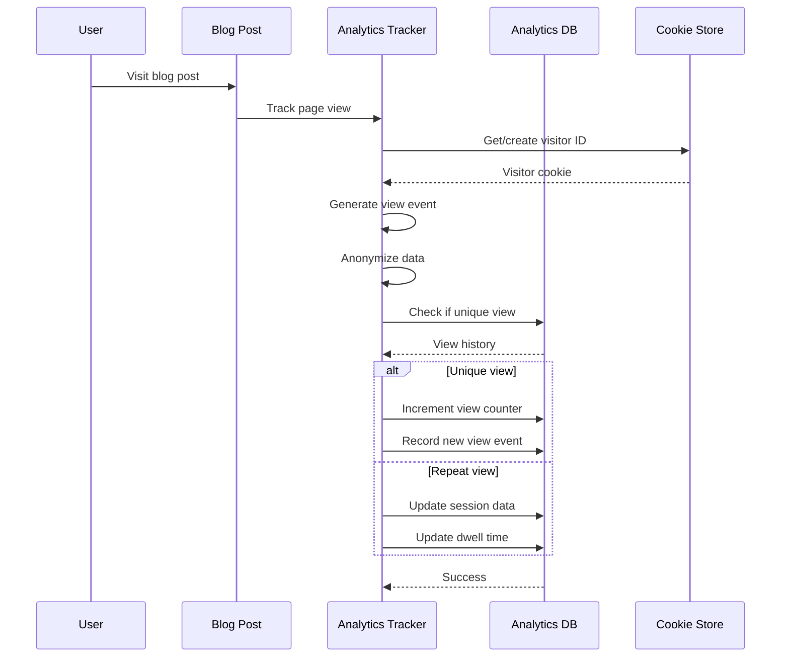
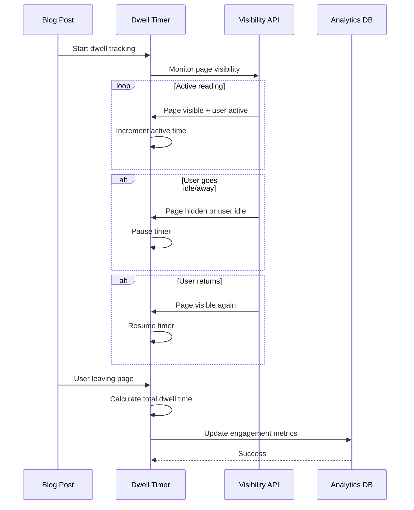
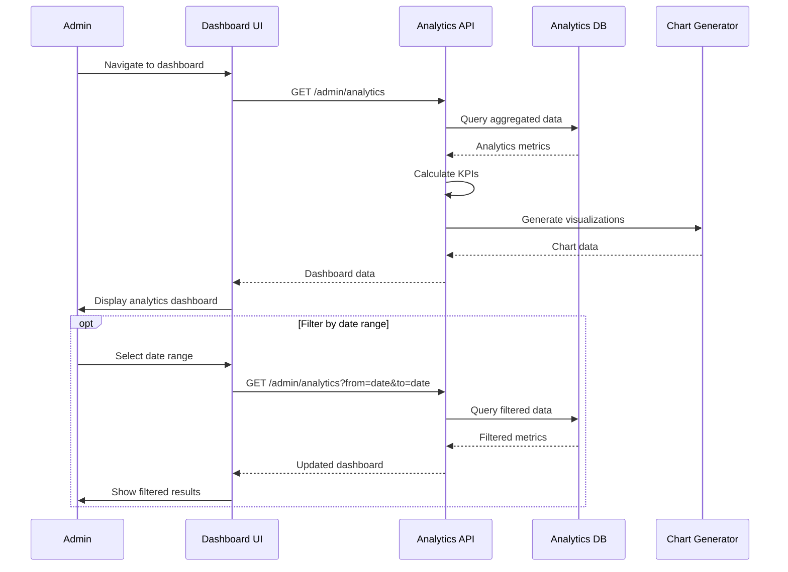
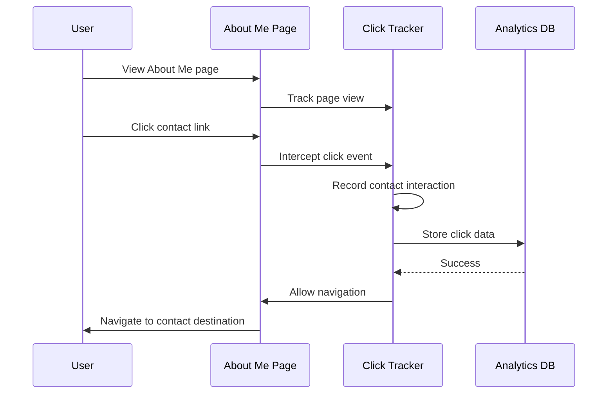
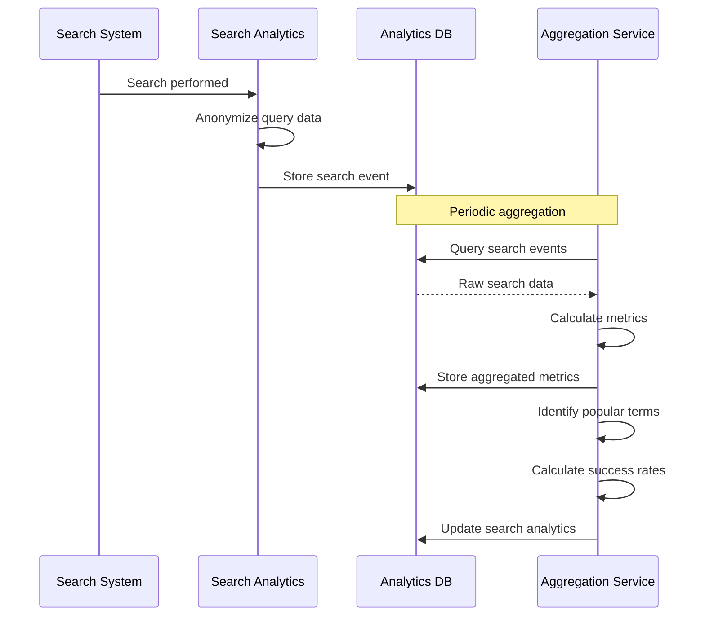
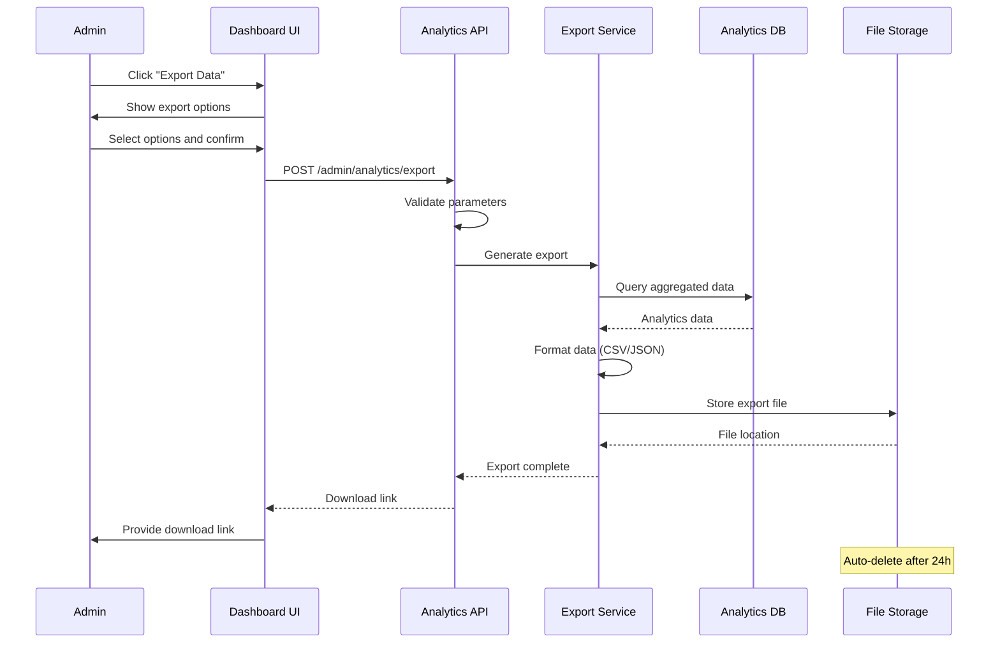

# Analytics Dashboard - PRD

## 📋 Domain Overview

**Domain**: Analytics (`analytics`)  
**Responsibility**: Simple data aggregation and dashboard reporting for blog insights  
**Key Entities**: PageView, ViewSession, AnalyticsEvent, DashboardMetric  

**Important Note**: This is a simple analytics system focused on data aggregation and basic reporting, not AI-powered data science or complex machine learning analytics.

## 🎯 Use Cases

### UC-AN-001: Track Page Views
**ID**: UC-AN-001  
**Name**: Track Blog Post Page Views  
**Actor**: System  
**Trigger**: User visits published blog post  
**Goal**: Record page view data for analytics reporting  

**Preconditions**:
- User visits a published blog post
- Analytics tracking is enabled
- User has not opted out of tracking

**Main Flow**:
1. User navigates to published blog post
2. System generates or retrieves visitor tracking cookie
3. System records page view event with metadata:
   - Post ID
   - Visitor ID (hashed cookie value)
   - Timestamp
   - User agent (anonymized)
   - Referrer source
   - Session duration start
4. System checks if this is a unique view (same visitor, same post)
5. System increments post view counter
6. System updates session tracking data
7. System stores analytics event in database

**Alternative Flows**:
- **2a**: User has disabled cookies → Use session-based tracking
- **4a**: Repeat view from same visitor → Update dwell time, don't increment counter
- **7a**: Analytics database unavailable → Queue event for later processing

**Business Rules**:
- Unique views counted once per visitor per post
- View count includes both unique and repeat views
- Session timeout: 30 minutes of inactivity
- Cookie-based tracking with privacy compliance
- Anonymous data collection only
- No personally identifiable information stored

**Security Requirements**:
- Visitor IDs are hashed, not reversible
- IP addresses anonymized (last octet masked)
- User agent strings anonymized
- GDPR/CCPA compliant tracking
- Opt-out mechanism available

**Authorization**: System

---

### UC-AN-002: Track Dwell Time
**ID**: UC-AN-002  
**Name**: Track User Engagement Time  
**Actor**: System  
**Trigger**: User interacts with blog post  
**Goal**: Measure how long users spend reading content  

**Preconditions**:
- User is viewing a blog post
- Page view tracking is active
- Browser supports visibility API

**Main Flow**:
1. System starts dwell time tracking when page loads
2. System monitors page visibility and user interaction
3. System tracks active reading time (page visible + user engaged)
4. System pauses timer when:
   - Page becomes hidden/backgrounded
   - User is idle for more than 30 seconds
   - Browser tab loses focus
5. System resumes timer when user returns to active reading
6. When user leaves page or closes tab:
7. System calculates total dwell time
8. System updates analytics record with engagement metrics
9. System stores dwell time data for reporting

**Alternative Flows**:
- **2a**: Visibility API not supported → Use basic focus/blur events
- **6a**: User navigates away quickly → Record as bounce
- **8a**: Analytics update fails → Queue for retry

**Business Rules**:
- Minimum meaningful dwell time: 10 seconds
- Maximum recorded dwell time: 30 minutes per session
- Idle time (no interaction) doesn't count toward dwell time
- Dwell time aggregated per post for analytics
- Average dwell time calculated across all viewers

**Security Requirements**:
- No tracking of specific user behavior patterns
- Dwell time data anonymized
- No keystroke or mouse tracking
- Privacy-compliant engagement tracking

**Authorization**: System

---

### UC-AN-003: Generate Analytics Dashboard
**ID**: UC-AN-003  
**Name**: Admin Analytics Dashboard  
**Actor**: Blog Administrator  
**Trigger**: Admin accesses analytics dashboard  
**Goal**: Display aggregated blog performance metrics  

**Preconditions**:
- Admin is authenticated
- Analytics data exists in system
- Admin navigates to dashboard

**Main Flow**:
1. Admin clicks "Dashboard" in admin navigation
2. System loads analytics dashboard page
3. System queries aggregated analytics data for date range
4. System calculates key metrics:
   - Total page views (today, week, month)
   - Unique visitors (today, week, month)
   - Most popular posts (by views)
   - Average dwell time per post
   - Traffic sources (referrers)
   - Search query popularity
5. System generates charts and visualizations
6. System displays dashboard with interactive filters
7. Admin can adjust date ranges and view different metrics
8. System provides data export functionality

**Alternative Flows**:
- **3a**: No analytics data available → Show "No data" message
- **5a**: Chart generation fails → Show tabular data instead
- **7a**: Date range too large → Limit to maximum 1 year

**Business Rules**:
- Default view: Last 30 days
- Maximum date range: 1 year
- Data aggregated by day, week, month
- Real-time data updates every 15 minutes
- Export formats: CSV, JSON
- Charts responsive to screen size

**Security Requirements**:
- Only admin can access analytics dashboard
- No individual visitor data displayed
- Aggregated data only
- Export data anonymized

**Authorization**: Admin

---

### UC-AN-004: Track Contact Interactions
**ID**: UC-AN-004  
**Name**: Track About Me Contact Clicks  
**Actor**: System  
**Trigger**: User clicks contact link on About Me page  
**Goal**: Measure engagement with contact information  

**Preconditions**:
- User is on About Me page
- Contact links are displayed
- Analytics tracking is enabled

**Main Flow**:
1. User views About Me page with contact information
2. System tracks page view for About Me
3. User clicks on contact link (email, social media, etc.)
4. System intercepts click event before navigation
5. System records contact interaction:
   - Contact type (email, twitter, instagram, etc.)
   - Timestamp
   - Visitor ID (anonymized)
   - Source page (About Me)
6. System allows normal navigation to contact destination
7. System aggregates contact click data for reporting

**Alternative Flows**:
- **4a**: JavaScript disabled → Use server-side redirect tracking
- **6a**: External link → Open in new tab after tracking

**Business Rules**:
- Track clicks on: email, social media, phone (if displayed)
- Contact interactions counted per session
- No tracking of what users do on external sites
- Aggregated by contact type and date
- Contact click data included in dashboard

**Security Requirements**:
- No tracking beyond the click event
- Contact interaction data anonymized
- No personal information stored
- External site privacy respected

**Authorization**: System

---

### UC-AN-005: Monitor Search Analytics
**ID**: UC-AN-005  
**Name**: Aggregate Search Query Analytics  
**Actor**: System  
**Trigger**: Search queries are performed  
**Goal**: Track popular search terms and search success rates  

**Preconditions**:
- Search functionality is active
- Users are performing searches
- Search analytics tracking enabled

**Main Flow**:
1. System detects search query from user
2. System anonymizes search query data
3. System records search event:
   - Search term (anonymized)
   - Number of results returned
   - Whether user clicked on results
   - Search timestamp
4. System aggregates search data periodically
5. System calculates search metrics:
   - Most popular search terms
   - Search success rate (clicks/searches)
   - Zero-result searches (improvement opportunities)
   - Average results per search
6. System includes search metrics in analytics dashboard

**Alternative Flows**:
- **2a**: Search query contains PII → Further anonymize or exclude
- **4a**: High search volume → Batch process aggregation

**Business Rules**:
- Search terms aggregated, not stored individually
- Only successful searches (with results) tracked for popularity
- Zero-result searches tracked for content gap analysis
- Search analytics retained for 90 days
- No association between searches and specific users

**Security Requirements**:
- Search query anonymization at collection
- No personal search history maintained
- Aggregate data only in reporting
- Regular data purging per retention policy

**Authorization**: System

---

### UC-AN-006: Export Analytics Data
**ID**: UC-AN-006  
**Name**: Export Analytics for External Analysis  
**Actor**: Blog Administrator  
**Trigger**: Admin requests data export  
**Goal**: Provide analytics data in exportable format  

**Preconditions**:
- Admin is authenticated
- Analytics data exists in system
- Admin is on analytics dashboard

**Main Flow**:
1. Admin clicks "Export Data" button on dashboard
2. System displays export options dialog
3. Admin selects:
   - Date range for export
   - Data types (views, engagement, search, etc.)
   - Export format (CSV, JSON)
4. Admin confirms export request
5. System validates export parameters
6. System queries and aggregates requested data
7. System generates export file
8. System provides download link to admin
9. System logs export activity for audit

**Alternative Flows**:
- **6a**: Date range too large → Limit to maximum 1 year
- **7a**: Export generation fails → Show error, suggest smaller range
- **8a**: File too large → Split into multiple files

**Business Rules**:
- Maximum export range: 1 year
- Only aggregated data, no individual visitor data
- Export files deleted after 24 hours
- Maximum file size: 10MB
- Admin audit trail for all exports

**Security Requirements**:
- Only admin can export data
- Exported data contains no PII
- Export files securely generated and stored
- Automatic cleanup of export files
- Export activity logged for compliance

**Authorization**: Admin

---

## 🔐 Security Policies

### Analytics Security Policy
- **Privacy Compliance**: GDPR/CCPA compliant data collection
- **Data Anonymization**: All visitor data anonymized at collection
- **Access Control**: Only admin can view analytics dashboard
- **Data Retention**: Raw data retained 90 days, aggregates 1 year

### Authorization Matrix

| Resource | Anonymous | Admin | System |
|----------|-----------|-------|--------|
| Generate Analytics Events | ✅ Tracked | ✅ Tracked | ✅ Full |
| View Analytics Dashboard | ❌ | ✅ Read | ❌ |
| Export Analytics Data | ❌ | ✅ Export | ❌ |
| Configure Analytics | ❌ | ✅ Full | ✅ Read |

### Data Protection
- **Visitor Privacy**: Hashed visitor IDs, no reversible tracking
- **IP Anonymization**: Last octet masked in all stored data
- **Opt-out Support**: Cookie-based opt-out mechanism
- **Data Minimization**: Only necessary data collected

## 📊 Acceptance Criteria

### UC-AN-001 (Track Page Views)
- [ ] Unique view counting per visitor per post
- [ ] Cookie-based visitor identification
- [ ] Anonymous data collection only
- [ ] Session tracking with 30-minute timeout
- [ ] View counter increments properly
- [ ] Privacy compliance maintained

### UC-AN-002 (Track Dwell Time)
- [ ] Active reading time measurement
- [ ] Page visibility API integration
- [ ] Idle time exclusion from dwell time
- [ ] Maximum 30-minute session limit
- [ ] Bounce detection for quick exits
- [ ] Engagement metrics calculation

### UC-AN-003 (Analytics Dashboard)
- [ ] Key metrics displayed (views, visitors, dwell time)
- [ ] Interactive date range selection
- [ ] Popular posts ranking
- [ ] Traffic source breakdown
- [ ] Responsive chart visualizations
- [ ] Data export functionality

### UC-AN-004 (Contact Tracking)
- [ ] Click tracking on About Me contact links
- [ ] Contact type categorization
- [ ] Normal navigation preserved after tracking
- [ ] Contact interaction aggregation
- [ ] Dashboard integration
- [ ] Privacy-compliant tracking

### UC-AN-005 (Search Analytics)
- [ ] Search query anonymization
- [ ] Popular search terms identification
- [ ] Search success rate calculation
- [ ] Zero-result search tracking
- [ ] 90-day data retention
- [ ] Dashboard integration

### UC-AN-006 (Data Export)
- [ ] CSV and JSON export formats
- [ ] Date range selection for exports
- [ ] Aggregated data only (no PII)
- [ ] Maximum 1-year export range
- [ ] Automatic file cleanup after 24 hours
- [ ] Export activity audit logging

## 🧪 Test Scenarios

### Privacy Testing
1. **Data Anonymization**: Verify no PII in collected data
2. **Opt-out Functionality**: Test cookie-based opt-out
3. **IP Anonymization**: Confirm last octet masking
4. **GDPR Compliance**: Test data retention and deletion

### Functionality Testing
1. **View Tracking**: Unique vs repeat view counting
2. **Dwell Time**: Active reading time calculation
3. **Dashboard Metrics**: Accuracy of aggregated data
4. **Search Analytics**: Query anonymization and aggregation
5. **Export Function**: Data export integrity and format

### Performance Testing
1. **Analytics Collection**: Impact on page load times
2. **Dashboard Loading**: Response time with large datasets
3. **Data Aggregation**: Performance of metric calculations
4. **Export Generation**: Large data export processing time

This analytics system provides essential blog insights through simple data aggregation while maintaining strict privacy compliance and focusing on actionable metrics rather than complex data science.