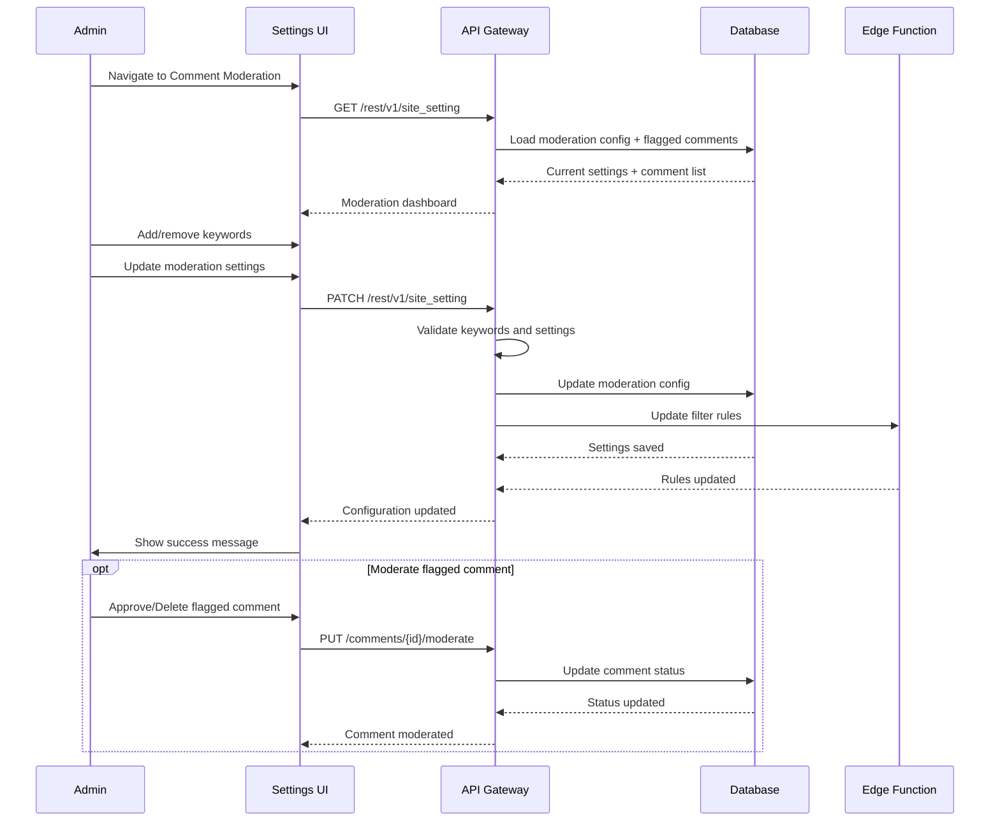
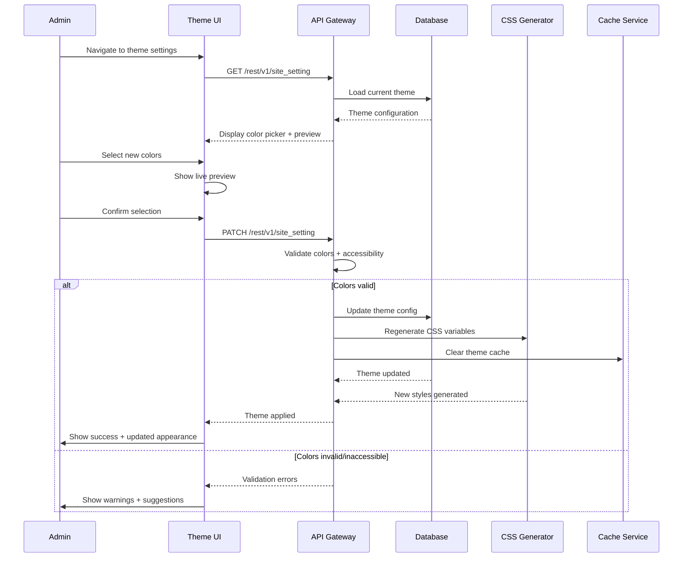
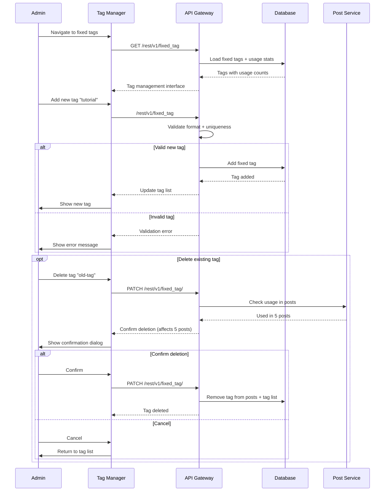
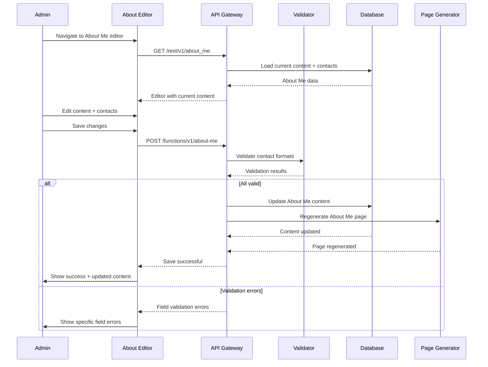
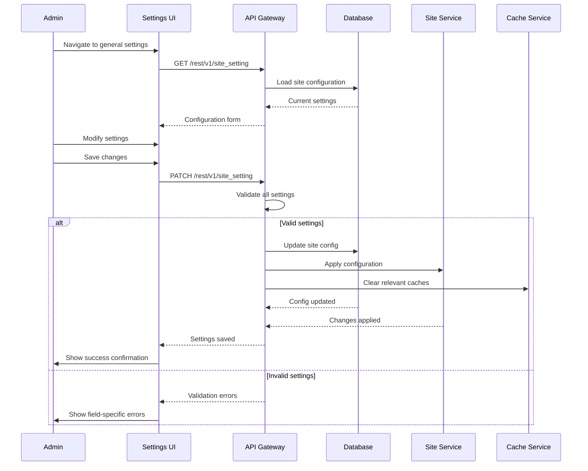
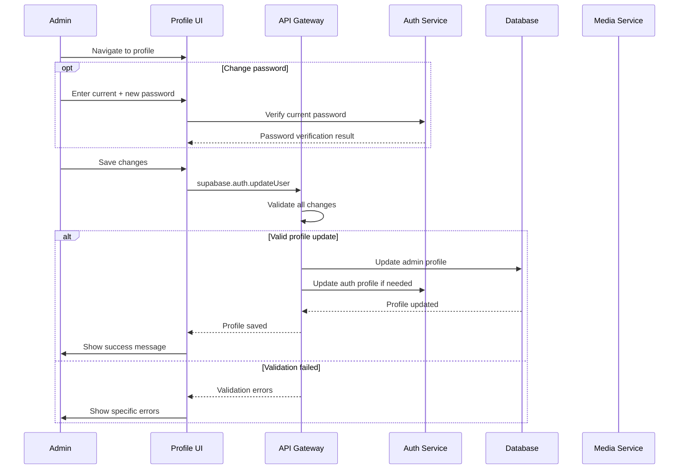
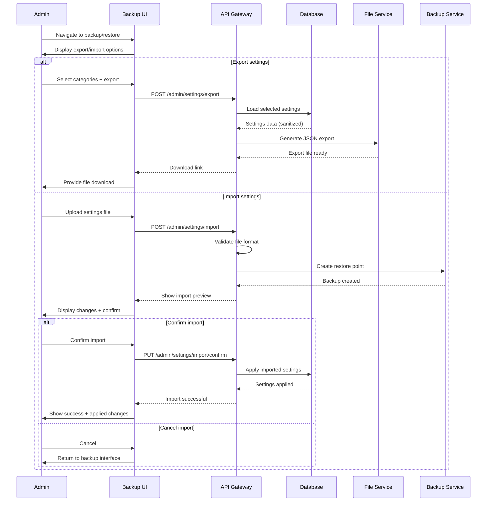

# Admin Settings & Configuration - PRD

## 📋 Domain Overview

**Domain**: Admin Settings (`admin`)  
**Responsibility**: Administrative configuration, blog customization, and content moderation  
**Key Entities**: SiteSettings, ThemeConfig, TagConfig, ContactInfo, CommentModeration, FilterKeywords  

**Important Note**: Comprehensive admin configuration including comment moderation, content filtering, theme customization, and site management. All settings require admin authentication.

## 🎯 Use Cases

### UC-AS-001: Comment Moderation Settings
**ID**: UC-AS-001  
**Name**: Configure Comment Filtering and Moderation  
**Actor**: Blog Administrator  
**Trigger**: Admin wants to manage comment moderation system  
**Goal**: Configure keyword filtering and moderation settings  

**Preconditions**:
- Admin is authenticated and logged in
- Admin is on admin settings page
- Comment system is operational

**Main Flow**:
1. Admin navigates to Admin Settings → Comment Moderation
2. System displays comment moderation configuration:
   - Keyword filtering section
   - Moderation settings
   - Flagged comments management
3. Admin manages filter keywords:
   - View current keyword list with remove buttons
   - Add new keywords using text input
   - Configure case-sensitive matching toggle
   - Set keyword matching patterns (exact/partial)
4. Admin configures moderation settings:
   - Auto-flag threshold (number of keywords)
   - Manual review requirement toggle
   - Anonymous commenting enable/disable
5. Admin reviews flagged comments:
   - List of flagged comments with context
   - Approve/Delete/Keep Flagged actions
   - Bulk moderation operations
6. Admin saves configuration changes
7. System updates moderation rules in database
8. System applies new rules to Supabase Edge Functions

**Alternative Flows**:
- **3a**: Invalid keyword format → Display validation error
- **5a**: No flagged comments → Display empty state
- **7a**: Save fails → Display error, maintain current settings

**Business Rules**:
- Maximum 100 filter keywords allowed
- Keywords 2-50 characters, no special characters except hyphens
- Case-sensitive matching configurable globally
- Flagged comments hidden from anonymous users
- Admin can always see all comments with flag indicators
- Keyword changes apply to new comments immediately

**Security Requirements**:
- Admin authentication required
- Keyword input sanitization
- Moderation action audit logging
- Safe keyword defaults to prevent over-filtering

**Authorization**: Admin only

---

### UC-AS-002: Theme Customization
**ID**: UC-AS-002  
**Name**: Customize Blog Theme and Appearance  
**Actor**: Blog Administrator  
**Trigger**: Admin wants to modify blog visual appearance  
**Goal**: Update theme colors and visual settings  

**Preconditions**:
- Admin is authenticated
- Admin is on theme settings page
- Theme system is operational

**Main Flow**:
1. Admin navigates to Admin Settings → Theme
2. System displays current theme configuration:
   - Light mode accent color (#D01C1F)
   - Dark mode accent color (#FF8200)
   - Border radius setting
   - Font preferences (future enhancement)
3. Admin modifies accent colors using color picker:
   - HEX color input (#FF0000)
   - RGB value sliders
   - HSV color wheel
   - Predefined color palette
4. System shows live preview of color changes
5. Admin adjusts border radius for consistent styling
6. Admin confirms color and style selections
7. System validates accessibility (WCAG contrast ratios)
8. System updates theme configuration in database
9. System regenerates CSS custom properties
10. System applies changes immediately across entire site

**Alternative Flows**:
- **3a**: Invalid color format → Show format error
- **7a**: Poor accessibility contrast → Show warning with suggestion
- **8a**: Database update fails → Show error, revert to previous theme

**Business Rules**:
- Separate accent colors for light and dark modes
- Colors must meet WCAG AA contrast requirements
- Border radius applies to all rounded elements site-wide
- Theme changes are immediately visible
- Color picker supports accessibility-friendly palettes
- Invalid colors fall back to safe defaults

**Security Requirements**:
- Admin authentication required
- Color input validation prevents CSS injection
- Theme changes audit logged
- Safe fallback colors for invalid values

**Authorization**: Admin only

---

### UC-AS-003: Fixed Tags Management
**ID**: UC-AS-003  
**Name**: Manage Fixed Tag Categories  
**Actor**: Blog Administrator  
**Trigger**: Admin wants to configure predefined tag categories  
**Goal**: Maintain list of fixed tags for content organization  

**Preconditions**:
- Admin is authenticated
- Admin is on tag management settings
- Tagging system is operational

**Main Flow**:
1. Admin navigates to Admin Settings → Fixed Tags
2. System displays current fixed tags list:
   - Default tags: "dev", "beer", "personal"
   - Usage statistics for each tag
   - Drag-and-drop reordering interface
3. Admin can perform tag operations:
   - Add new fixed tag with validation
   - Edit existing tag names
   - Delete unused tags with confirmation
   - Reorder tags for display priority
4. For adding new tag:
   - Admin enters tag name
   - System validates format (lowercase, alphanumeric + hyphens)
   - System checks for duplicates
   - System adds to fixed tags list
5. For deleting tags:
   - System checks if tag is used in posts
   - Shows usage count and affected posts
   - Requires confirmation for tags in use
6. Admin saves tag configuration
7. System updates fixed tags in database
8. System refreshes tag UI components across site

**Alternative Flows**:
- **4a**: Invalid tag format → Show format requirements
- **4b**: Duplicate tag → Show "already exists" error
- **5b**: Tag in use → Show confirmation with usage count

**Business Rules**:
- Tag names: lowercase, alphanumeric, hyphens only
- Maximum 20 fixed tags allowed
- Default tags: "dev", "beer", "personal"
- Tags appear in post editor and search sidebar
- Deleting used tags removes from all posts
- Tag order affects display priority in UI

**Security Requirements**:
- Admin authentication required
- Tag name sanitization
- Deletion confirmation for destructive actions
- Audit trail for tag management

**Authorization**: Admin only

---

### UC-AS-004: About Me Content Management
**ID**: UC-AS-004  
**Name**: Update About Me Page and Contact Information  
**Actor**: Blog Administrator  
**Trigger**: Admin wants to update personal information  
**Goal**: Modify About Me content and contact details  

**Preconditions**:
- Admin is authenticated
- Admin accesses About Me editor via settings or About Me page
- Content management system is operational

**Main Flow**:
1. Admin navigates to Admin Settings → About Me
2. System displays About Me content editor:
   - Markdown editor for introduction content
   - Contact information form
   - Preview section
3. Admin edits personal introduction using markdown editor
4. Admin updates contact information:
   - Email address (with validation)
   - X (Twitter) handle
   - Instagram handle
   - Facebook profile URL
   - Phone number (international format)
5. System validates contact information formats:
   - Email format validation
   - Social media handle format checks
   - Phone number format validation
6. Admin previews About Me page with changes
7. Admin saves content and contact updates
8. System updates About Me content in database
9. System regenerates About Me page
10. System updates contact sidebar display

**Alternative Flows**:
- **5a**: Invalid email format → Show validation error
- **5b**: Invalid social handle → Show format guidance
- **6a**: Preview fails → Save anyway, show preview error

**Business Rules**:
- About Me content supports full markdown
- All contact fields are optional
- Only filled contact fields show icons in sidebar
- Email addresses validated for proper format
- Social handles validated for platform conventions
- Phone numbers support international formats

**Security Requirements**:
- Admin authentication required
- Contact information sanitization
- Email protection from bot harvesting
- Social media link validation for safety

**Authorization**: Admin only

---

### UC-AS-005: General Site Configuration
**ID**: UC-AS-005  
**Name**: Configure Site-Wide Settings  
**Actor**: Blog Administrator  
**Trigger**: Admin needs to configure general blog settings  
**Goal**: Update site metadata, features, and global preferences  

**Preconditions**:
- Admin is authenticated
- Admin is on general settings page
- Site configuration system is operational

**Main Flow**:
1. Admin navigates to Admin Settings → General
2. System displays site configuration options:
   - Site title and tagline
   - SEO metadata defaults
   - Feature toggles (comments, analytics)
   - Privacy settings (cookie consent)
   - Performance settings (caching)
3. Admin modifies site identity:
   - Update site title (appears in header and browser tab)
   - Update tagline (appears in meta description)
   - Set default SEO keywords
4. Admin configures feature settings:
   - Global comment enable/disable
   - Analytics tracking toggle
   - Search functionality enable/disable
5. Admin updates privacy settings:
   - Cookie consent banner configuration
   - Privacy policy link
   - Data retention settings
6. Admin saves all configuration changes
7. System validates all setting values
8. System updates site configuration in database
9. System applies changes across affected areas
10. System shows confirmation of updates

**Alternative Flows**:
- **7a**: Invalid setting value → Show validation error
- **8a**: Database update fails → Show error, maintain current settings

**Business Rules**:
- Site title limited to 60 characters for SEO
- Tagline limited to 160 characters for meta description
- Feature toggles take effect immediately
- Privacy settings affect cookie handling
- Analytics toggle controls tracking code inclusion
- All changes logged for audit purposes

**Security Requirements**:
- Admin authentication required
- Setting value validation and sanitization
- Configuration change audit logging
- Safe defaults for all critical settings

**Authorization**: Admin only

---

### UC-AS-006: Admin User Password Change Password
**ID**: UC-AS-006  
**Name**: Manage Admin Change User Password 
**Actor**: Blog Administrator  
**Trigger**: Admin wants to change password
**Goal**: Maintain admin security

**Preconditions**:
- Admin is authenticated
- Admin is on profile settings page
- User management system is operational

**Main Flow**:
1. Admin navigates to Admin Settings → Change Password
2. Admin updates profile information:
3. Admin can change password:
   - Enter current password for verification
   - Set new password meeting security requirements
   - Confirm new password
5. Admin saves profile changes
6. System validates all updates
7. System updates admin profile in database
8. System updates admin identity across site

**Alternative Flows**:
- **3b**: Invalid email format → Show validation error
- **4a**: Invalid image format → Show supported formats
- **4b**: Image too large → Show size limit error
- **5c**: Weak new password → Show strength requirements

**Business Rules**:
- Display name appears in admin posts and comments
- Email must be unique and valid format
- Avatar images: JPG/PNG only, max 2MB
- Password changes require current password verification
- Profile changes affect admin identity site-wide
- Password must meet NIST security guidelines

**Security Requirements**:
- Current password required for sensitive changes
- Email change validation prevents account takeover
- Avatar upload security (type/size validation)
- Password strength enforcement
- Profile change audit logging

**Authorization**: Admin only

---

### UC-AS-007: Settings Export/Import
**ID**: UC-AS-007  
**Name**: Backup and Restore Configuration  
**Actor**: Blog Administrator  
**Trigger**: Admin wants to backup or migrate settings  
**Goal**: Export/import site configuration for backup or transfer  

**Preconditions**:
- Admin is authenticated
- Admin is on backup/restore settings page
- All settings systems are operational

**Main Flow**:
1. Admin navigates to Admin Settings → Backup/Restore
2. System displays export/import interface
3. For settings export:
   - Admin selects setting categories to include:
     - Theme configuration
     - Fixed tags
     - Comment moderation settings
     - Site configuration
     - About Me content
   - Admin clicks "Export Settings"
   - System generates JSON configuration file
   - System excludes sensitive data (passwords, keys)
   - System provides download link
4. For settings import:
   - Admin uploads settings backup file
   - System validates JSON format and structure
   - System shows preview of changes to be applied
   - System creates automatic backup before import
   - Admin confirms import operation
   - System applies imported settings
5. System logs all backup/restore operations
6. System shows completion status and affected areas

**Alternative Flows**:
- **3d**: Export generation fails → Show error, suggest retry
- **4b**: Invalid import file → Show format validation error
- **4d**: Import contains incompatible settings → Skip invalid, import valid

**Business Rules**:
- Export includes all configurable settings except passwords
- Import file must be valid JSON with correct schema
- Automatic backup created before any import
- Imported settings validated before application
- Export excludes sensitive authentication data
- Settings categories can be selectively exported/imported

**Security Requirements**:
- Admin authentication required
- Export excludes all sensitive data
- Import file validation prevents injection
- Backup operations audit logged
- Automatic restore point creation

**Authorization**: Admin only

---

## 🔐 Security Policies

### Admin Settings Security Policy
- **Authentication**: Admin JWT token required for all settings access
- **Authorization**: Only approved admin users can modify settings
- **Input Validation**: All setting values validated and sanitized
- **Audit Logging**: Comprehensive logging of all configuration changes
- **Safe Defaults**: Fallback values for all settings prevent system breaks

### Comment Moderation Security Policy
- **Keyword Filtering**: Real-time content filtering via Edge Functions
- **Admin Visibility**: Admin can see all comments regardless of status
- **Moderation Actions**: All approve/delete actions logged with timestamp
- **Content Sanitization**: Comment content sanitized before display

### Authorization Matrix

| Resource | Anonymous | Admin |
|----------|-----------|-------|
| **View Settings** | ❌ | ✅ Full |
| **Comment Moderation** | ❌ | ✅ Full |
| **Theme Configuration** | ❌ | ✅ Full |
| **Fixed Tags Management** | ❌ | ✅ Full |
| **About Me Content** | ❌ | ✅ Full |
| **Site Configuration** | ❌ | ✅ Full |
| **Profile Management** | ❌ | ✅ Full |
| **Settings Backup** | ❌ | ✅ Full |

### Data Protection
- **Sensitive Data**: Passwords and API keys never exported
- **Audit Trail**: All configuration changes tracked with admin ID
- **Backup Security**: Export files contain no authentication data
- **Change Validation**: All imports validated before application

## 📊 Acceptance Criteria

### UC-AS-001 (Comment Moderation)
- [ ] Keyword management (add/edit/delete with validation)
- [ ] Case-sensitive matching toggle
- [ ] Flagged comments list with context
- [ ] Approve/Delete/Keep Flagged actions
- [ ] Real-time application of filter changes
- [ ] Edge Function integration for filtering

### UC-AS-002 (Theme Customization)
- [ ] Color picker with HEX/RGB/HSV support
- [ ] Live preview of color changes
- [ ] WCAG accessibility validation
- [ ] Separate light/dark mode colors
- [ ] Border radius configuration
- [ ] Immediate site-wide application

### UC-AS-003 (Fixed Tags Management)
- [ ] Add/edit/delete/reorder fixed tags
- [ ] Tag format validation and uniqueness
- [ ] Usage statistics and deletion warnings
- [ ] Drag-and-drop reordering
- [ ] Maximum 20 tags limit enforcement

### UC-AS-004 (About Me Management)
- [ ] Markdown editor with preview
- [ ] Contact form with validation
- [ ] Optional contact fields
- [ ] Social media handle validation
- [ ] Real-time sidebar updates

### UC-AS-005 (Site Configuration)
- [ ] Site title and tagline settings
- [ ] Feature toggles (comments/analytics)
- [ ] Privacy and cookie settings
- [ ] SEO metadata defaults
- [ ] Immediate application of changes

### UC-AS-006 (Profile Management)
- [ ] Display name and email updates
- [ ] Avatar upload and processing
- [ ] Password change with verification
- [ ] Email uniqueness validation
- [ ] Site-wide identity updates

### UC-AS-007 (Settings Backup) future feature
- [ ] Selective category export
- [ ] JSON format validation for imports
- [ ] Import preview and confirmation
- [ ] Automatic restore point creation
- [ ] Sensitive data exclusion from exports

## 🧪 Test Scenarios

### Security Testing
1. **Authentication**: Verify admin-only access to all settings
2. **Input Validation**: Test malicious input in all configuration fields
3. **File Security**: Test avatar upload and settings import security
4. **Audit Logging**: Verify all changes properly logged
5. **Sensitive Data**: Ensure passwords/keys never exported

### Functional Testing
1. **Comment Moderation**: Complete keyword filtering and moderation workflow
2. **Theme Changes**: Color picker functionality and live preview
3. **Tag Management**: CRUD operations with validation and usage tracking
4. **Content Updates**: About Me editing and contact validation
5. **Configuration**: Site settings and feature toggles
6. **Backup/Restore**: Export/import with validation and rollback

### Integration Testing
1. **Cross-Component**: Settings changes affect entire site immediately
2. **Database Consistency**: Settings persistence and retrieval
3. **Cache Invalidation**: Proper cache clearing after changes
4. **Real-time Updates**: Edge Function filter updates
5. **UI Synchronization**: Immediate visual application of changes

### Performance Testing
1. **Settings Load**: Dashboard loading with large configurations
2. **Theme Application**: CSS regeneration and cache clearing
3. **Comment Filtering**: Edge Function performance with many keywords
4. **Export Generation**: Large configuration export performance
5. **Import Processing**: Settings import and validation speed

This comprehensive admin settings system provides complete control over all blog aspects while maintaining security, usability, and integration with the existing Supabase infrastructure.